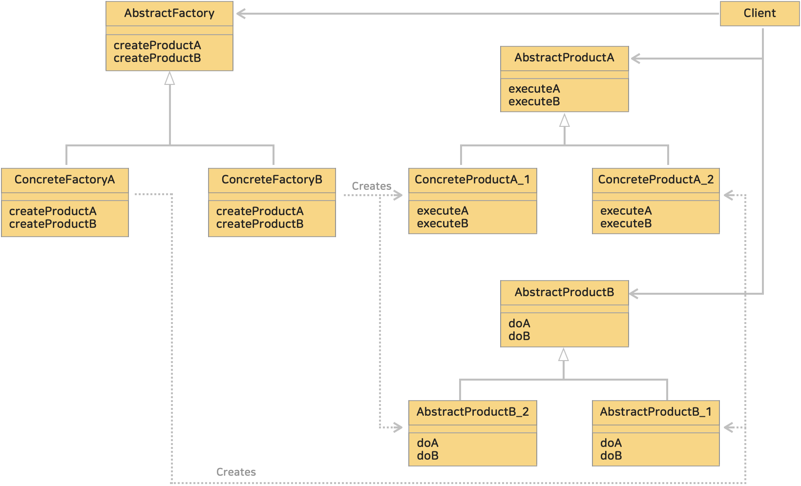

# 8. 추상 팩토리 패턴 (Abstract Factory Pattern)
> 제품군을 생성하기 위한 인터페이스를 생성하고 그 인터페이스를 구성하여 사용할 수 있게끔 하는것

> 객체 생성 관련 패턴 중 하나로 객체의 생성을 담당하는 인터페이스를 제공하고, 이를 구현한 여러 팩토리 클래스를 통해 객체를 생성하는 디자인 패턴이다.
> 이 패턴은 관련이 있는 객체들을 함께 생성하고, 이들 객체의 구성을 일관성 있게 유지할 수 있도록 한다.
>> abstract factory 는 '추상적인 공장'이라는 의미로 '추상적인 부품'을 조합하여 '추상적인 제품'을 만들어낸다.<br>
>> '추상적'이라는 의미는 '구체적으로 어떻게 구현되어 있는지 생각하지 않고 인터페이스에만 주목하는 상태'를 의미한다.<br>
>> 즉, 부품의 **구체적인 구현보다는 인터페이스만 사용해서 부품을 조립하고 제품으로 만들어 내는 것이**다.

* 블로그 링크 : [클릭](https://gymdev.tistory.com/23#section-6)
* 블로그 관련 소스코드 : [클릭](https://github.com/jmr10200/design-pattern/tree/master/src/main/java/hello/example/designpattern/factory/abstractfactory)

<br><hr>

### <예제 프로그램>
Abstract Factory 패턴을 사용해 컴퓨터를 만드는 프로그램

| **역할**                 | **이름**                                                                                                                                      | **내용**                                                                                                  |
|:-------------------|:--------------------------------------------------------------------------------------------------------------------------------------------|---------------------------------------------------------------------------------------------------------|
| **추상 제품 인터페이스**    | [Computer 인터페이스 (소스보기)](../src/main/java/hello/example/designpattern/factory/abstractfactory/computer/Computer.java)                        | 추상 팩토리에서 생산되는 추상적인 제품 Computer 로 구체적인 제품은 하위 클래스를 통해 만든다.                                               |
| **추상 제품 인터페이스**    | [Keyboard 인터페이스 (소스보기)](../src/main/java/hello/example/designpattern/factory/abstractfactory/computer/Keyboard.java)                        | 추상 팩토리에서 생산되는 추상적인 제품 Keyboard 로 구체적인 제품은 하위 클래스를 통해 만든다.                                               |
| Computer 구체 클래스    | [Desktop 클래스 (소스보기)](../src/main/java/hello/example/designpattern/factory/abstractfactory/computer/Impl/Desktop.java)                       | 추상적인 제품 Computer 를 구현한 구체적인 제품 Desktop 클래스                                                              |
| Computer 구체 클래스    | [Loptop 클래스 (소스보기)](../src/main/java/hello/example/designpattern/factory/abstractfactory/computer/Impl/Laptop.java)                         | 추상적인 제품 Computer 를 구현한 구체적인 제품 Laptop 클래스                                                               |
| Keyboard 구체 클래스    | [MechanicaKeyboard 클래스 (소스보기)](../src/main/java/hello/example/designpattern/factory/abstractfactory/computer/Impl/MechanicaKeyboard.java)   | 추상적인 제품 Keyboard 를 구현한 구체적인 제품 MechanicaKeyboard 클래스                                                    |
| Keyboard 구체 클래스    | [MembraneKeyboard 클래스 (소스보기)](../src/main/java/hello/example/designpattern/factory/abstractfactory/computer/Impl/MembraneKeyboard.java)     | 추상적인 제품 Keyboard 를 구현한 구체적인 제품 MembraneKeyboard 클래스                                                     |
| **추상 팩토리 인터페이스**   | [ElectronicsFactory 인터페이스 (소스보기)](../src/main/java/hello/example/designpattern/factory/abstractfactory/computer/ElectronicsFactory.java)    | 추상적인 공장을 나타내는 추상 팩토리 인터페이스 <br> 제품을 생산하지만 반환 값의 타입은 추상적인 제품으로 하위 클래스에 위임하고 있다.(subclass responsibility) |
| Desktop 구체 팩토리 클래스 | [DesktopFactory 클래스 (소스보기)](../src/main/java/hello/example/designpattern/factory/abstractfactory/computer/Impl/DesktopFactory.java)         | 추상 팩토리 인터페이스를 구현한 구체적인 데스크탑을 만드는 팩토리 클래스                                                                |
| Laptop 구체 팩토리 클래스  | [LoptopFactory 클래스 (소스보기)](../src/main/java/hello/example/designpattern/factory/abstractfactory/computer/Impl/LaptopFactory.java)           | 추상 팩토리 인터페이스를 구현한 구체적인 랩탑을 만드는 팩토리 클래스                                                                  |
| 클라이언트              | [ComputerFactoryTest 실행 클래스 (소스보기)](../src/test/java/hello/example/designpattern/factory/abstractfactory/computer/ComputerFactoryTest.java) | 동작 테스트용 클래스                                                                                             |

추상 팩토리를 이용하여 제품을 만든다. 다음과 같이 데스크탑 팩토리 (DesktopFactory)를 사용하여 데스크탑과 그 키보드를 생성하고 사용한다.
```java
public class Client {
    public static void main(String[] args) {
        // 팩토리 선택 : 데스크탑 팩토리
        ElectronicsFactory factory2 = new DesktopFactory();

        // 제품 생성
        Computer computer2 = factory2.createComputer();
        Keyboard keyboard2 = factory2.createKeyboard();

        // 제품 사용
        computer2.showInfo();
        keyboard2.info();
    }
}
```

<br><hr>

### (1) Abstract Factory 패턴의 클래스 다이어 그램
</img><br/>

<br>

### (2) 복잡성이 증가할 수 있다.
팩토리 클래스와 제품 클래스가 늘어날수록 복잡성이 증가할 수 있다.

<br>

### (3) 제품 (Product) 의 확장(추가)은 어렵다.
Abstract Factory 패턴에서 어떤 새로운 제품을 추가하려면 이미 존재하는 구체적인 팩토리(공장) 전부를 수정해야하므로 확장이 어려울 수 있다.

<br>

### (4) 구체적인 공장 (Factory) 의 확장(추가)은 간단하다.
구체적인 팩토리를 추가하는 과정은 각각의 추상메소드를 구현하는 일 이므로 간단하다.

<br>

### (5) 팩토리에서 생성된 제품(객체)들이 일관성을 유지한다.

<br><hr>

## # 정리
### 1. 관련된 '객체의 집합'을 생성하기 위한 인터페이스를 제공한다.
### 2. 팩토리 클래스와 제품 클래스가 늘어날수록 복잡성이 증가할 수 있다.