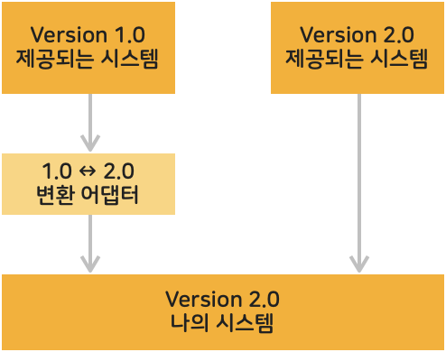

# 2. 어댑터 패턴 (Adapter Pattern)
>한 클래스의 인터페이스를 클라이언트에서 사용하고자하는 다른 인터페이스로 변환한다. 어댑터를 이용하면 인터 페이스 호환성 문제 때문에 같이 쓸 수 없는 클래스들을 연결해서 쓸 수 있다.

* 블로그 링크 : [클릭](https://gymdev.tistory.com/24)
* 블로그 관련 소스코드 : [클릭](https://github.com/jmr10200/design-pattern/tree/master/src/main/java/hello/example/designpattern/adapter/duck)

<br>


220v를 사용하는 충전기를 110v를 사용하는 나라에 여행갔을때 사용하려면 변환해주는 어댑터가 필요하다. <br>

프로그래밍 세계에서도 이미 존재하는 시스템에 새롭게 제공받는 시스템을 그대로 사용할 수 없을때 이를 변환해야 하는 경우가 발생한다. 이때 사용하는 디자인 패턴이 어댑터 패턴이다. <br>

시스템을 포장해서 사용할 수 있도록 한다고 해서 감싼다는 의미의 wrapper를 붙여 **래퍼(Wrapper) 패턴**이라고도 한다.

<hr>

<br>

### (1) 클래스에 의한 Adapter 패턴 (상속을 사용한 패턴, 클래스를 사용)

| **내용**          | **예제코드**                                                                                                         |
|:----------------|:-----------------------------------------------------------------------------------------------------------------|
| 제공된 것 (제공된 시스템) | [Banner 클래스 (클릭하여 소스보기)](../src/main/java/hello/example/designpattern/adapter/yuki/Banner.java)                  |
| 변환 장치 (어댑터)     | [PrintBanner 클래스 (클릭하여 소스보기)](../src/main/java/hello/example/designpattern/adapter/yuki/extend/PrintBanner.java) |
| 필요한 것 (현재 시스템)  | [Print 인터페이스 (클릭하여 소스보기)](../src/main/java/hello/example/designpattern/adapter/yuki/extend/Print.java)           |

어댑터 역할은 PrintBanner 클래스이다. 제공된 Banner 클래스를 **상속**받아 필요한 print 인터페이스를 **구현**한다.
```java
public class PrintBanner extends Banner implements Print{
    // 생성자 생략
    @Override
    public void printWeak() {
        showWithParen(); // 상속받은 Banner 클래스의 메소드를 호출하여 인터페이스를 구현
    }

    @Override
    public void printStrong() {
        showWithAster(); // 구현
    }
}
```

<br>

### (2) 인스턴스에 의한 Adapter 패턴 (위임을 사용한 패턴, 인스턴스를 사용)

| **내용**          | **예제코드**                                                                                                                         |
|:----------------|:---------------------------------------------------------------------------------------------------------------------------------|
| 제공된 것 (제공된 시스템) | [Banner 클래스 (클릭하여 소스보기)](../src/main/java/hello/example/designpattern/adapter/yuki/Banner.java)                                  |
| 변환 장치 (어댑터)     | [PrintBanner 클래스 (클릭하여 소스보기)](../src/main/java/hello/example/designpattern/adapter/yuki/delegation/PrintBannerByDelegation.java) |
| 필요한 것 (현재 시스템)  | [Print 인터페이스 (클릭하여 소스보기)](../src/main/java/hello/example/designpattern/adapter/yuki/delegation/PrintByDelegation.java)           |

자바는 두개의 클래스를 동시에 상속할 수 없다.(단일상속) <br>
어댑터 역할인 PrintBanner 클래스는 banner 필드로 Banner 클래스의 **인스턴스**를 갖는다. 이 인스턴스는 PrintBanner 클래스의 생성자에서 생성하고, banner 필드를 통해 메소드를 호출한다.
<br>

일반적으로 상속보다 위임을 사용하는 것이 문제가 더 적다. 상위 클래스의 내부 동작을 자세히 모르면 상속을 효과적으로 사용하기 어려운 경우가 많기 때문이다.

```java
public class PrintBannerByDelegation extends PrintByDelegation {

    private Banner banner; // 인스턴스

    public PrintBannerByDelegation(String copy) {
        this.banner = new Banner(copy); // 생성자로 Banner 클래스 생성
    }

    @Override
    public void printWeak() {
        banner.showWithParen(); // 자신이 처리하지않고 인스턴스의 메소드에 처리를 맡긴다(위임)
    }

    @Override
    public void printStrong() {
        banner.showWithAster(); // 인스턴스의 메소드에 처리를 맡긴다(위임)
    }
}
```

<hr>


## # 정리
### 1. 이미 존재하는 클래스를 이용하는데 사용한다.
프로그래밍에는 늘 새로운 것만 만들지는 않는다. 기존에 존재하는 시스템을 이용하는 경우도 흔하다. 기존 코드가 충분한 테스트를 거쳐 안정적이라면 해당 코드를 변경하지 않고 사용하는 것이 좋다.
이때, 기존에 존재하는 해당 코드(Adaptee)를 한겹 덧씌워 사용할 수 있게 만드는 것이 Adapter 이다. 만약 버그가 발생하면 기존의 코드는 버그가 없다는 것을 알기에 감싸준 Adapter 를 점검하면 될 것이다.

### 2. 버전과 호환성 관리에 유용하다.

버전 업을 할 때는 '구버전과의 호환성'이 문제가 된다. Adapter 패턴을 이용하면 구버전과 새버전이 공존할 수 있도록 하고, 유지보수까지 편하게 도와준다. 새버전의 클래스를 사용하여 구버전의 메소드를 구현하는 Adapter 를 만들면 된다.
