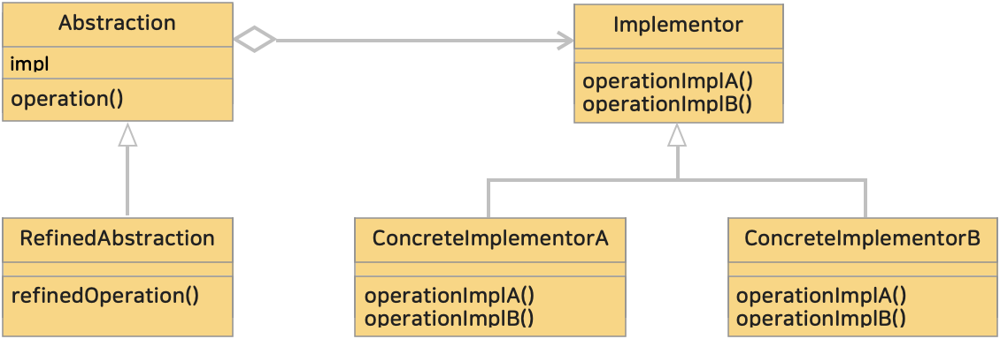

# 9. 브릿지 패턴 (Bridge Pattern)
> 구현부에서 추상층을 분리하여 각자 독립적으로 변형할 수 있게 하는 패턴이다.

> 객체의 구현부(implementation)와 추상층(abstraction)을 분리하여 각각 독립적으로 변형할 수 있게 하는 구조적인 디자인 패턴 중 하나이다.
> 이 패턴은 서로 독립된 두 개의 계층이 서로 연결되어 동작하게 하는 것을 중점으로 한다.
>> 'bridge' 란 '다리' 라는 의미로 다음의 두 장소에서 연결하는 역할을 한다.
>> 1. 기능의 클래스 계층
>> 2. 구현의 클래스 계층

<br>

## ■ 클래스 계층의 두 가지 역할
### (1) 기능을 추가하는 '기능의 클래스 계층에서 연결'
Pizza 라는 클래스에 새로운 기능을 추가하고 싶을 때, CheesePizza 하위 클래스를 생성한다. <br>
그리고 CheesePizza 클래스에 새로운 기능을 또 추가한다고 가정하면 다음과 같이 *계층이 한층 더 깊어*진다.
```text
Pizza
∟ CheesePizza
  ∟ CheddarCheesePizza
```
위의 계층은 기능을 추가하기위해 만들어졌다. 이를 **기능의 클래스 계층**이라 한다.
* 상위 클래스는 기본적인 기능을 가지고 있다.
* 하위 클래스에서 새로운 기능을 추가한다.

이렇게 *새로운 기능을 추가하고 싶을 때, 클래스 계층 안에서 가장 적합한 클래스를 찾아 그 하위 클래스를 만들고, 
원하는 기능을 추가한 새로운 클래스를 생성하는 것*이 **기능의 클래스 계층**이다.

<br>

### (2) 구현을 추가하는 '구현의 클래스 계층에서 연결'
상위 추상 클래스를 구현하여 하위 클래스 ConcreteClassA 를 생성하면 다음과 같은 계층이 만들어진다. <br>
또 다른 구현을 추가하면 다음과 같이 AbstractClass 를 구현한 또 다른 클래스 ConcreteClassB 가 생성된다.
```text
AbstractClass
⊢ ConcreteClassA
∟ ConcreteClassB
```
위의 계층은 기능을 추가하기 위해서 만들어진게 아니다. 다음과 같은 역할 분담을 위해 계층이 사용되어 **구현의 클래스 계층**이라 한다.
* 상위 클래스는 추상 메소드로 인터페이스를 규정한다.
* 하위 클래스는 구상 메소드로 그 인터페이스를 구현한다.

이렇게 *새로운 구현을 추가하고 싶을 때, AbstractClass 의 하위 클래스를 만들고 추상 메소드를 구현하는 것*이 **구현의 클래스 계층**이다.

<br>

### (3) 클래스 계층의 분리, 그리고 연결하는 다리
정리하면 하위클래스를 만들고자할때 의도를 확인해야한다.

* 기능을 추가하는 것인가?
* 구현을 추가하는 것인가?

클래스 계층이 하나라면 *기능의 클래스 계층*과 *구현의 클래스 계층*이 혼재하게된다. <br>
그래서 ***두 개의 독립된 클래스 계층***으로 나눈다.

이 때, 그 두 클래스 계층 사이에 다리를 놓을 필요가 있는데, 이 역할을 하는 것이 브릿지(bridge) 패턴이다.

<br><hr>

### <예제 프로그램>
Bridge 패턴을 사용해 컴퓨터를 설명한다. 컴퓨터는 기능과 운영체제(OS)로 나뉘며 여기서 기능은 추상화의 한 측면이고, 운영체제는 이를 구체화하는 구현자 역할을 한다.

| **클래스 계층**    | **역할**                         | **이름**                                                                                                                   | **내용**                                        |
|:--------------|:-------------------------------|:-------------------------------------------------------------------------------------------------------------------------|-----------------------------------------------|
| 기능의 클래스 계층    | Abstraction (추상화)                | [Computer 클래스 (소스보기)](../src/main/java/hello/example/designpattern/bridge/computer/Computer.java)                        | Computer 의 기능, 추상화 역할                         |
| 기능의 클래스 계층    | RefinedAbstraction (세부적인 추상화)  | [Desktop 클래스 (소스보기)](../src/main/java/hello/example/designpattern/bridge/computer/Desktop.java)                          | Computer 에 '고성능 그래픽'이라는 세부적인 기능을 추가한 Desktop 클래스 |
| 기능의 클래스 계층    | RefinedAbstraction (세부적인 추상화)  | [Laptop 클래스 (소스보기)](../src/main/java/hello/example/designpattern/bridge/computer/Laptop.java)                            | Computer 에 '접을수 있다'는 세부적인 기능을 추가한 Laptop 클래스  |
| 구현의 클래스 계층    | Implementor (구현자)              | [OperatingSystem 인터페이스 (소스보기)](../src/main/java/hello/example/designpattern/bridge/computer/OperatingSystem.java)        | 구현자 인터페이스, 추상화를 실제로 구현하는 역할                   |
| 구현의 클래스 계층    | ConcreteImplementor (구체적인 구현자) | [Windows 클래스 (소스보기)](../src/main/java/hello/example/designpattern/bridge/computer/Windows.java)                          | OperatingSystem 인터페이스를 구현한 구체적인 OS 클래스        |
| 구현의 클래스 계층    | ConcreteImplementor (구체적인 구현자) | [MacOS 클래스 (소스보기)](../src/main/java/hello/example/designpattern/bridge/computer/MacOS.java)                              | OperatingSystem 인터페이스를 구현한 구체적인 OS 클래스        |
| -             | 클라이언트                          | [ComputerBridgeTest 실행 클래스 (소스보기)](../src/test/java/hello/example/designpattern/bridge/computer/ComputerBridgeTest.java) | 동작 테스트용 클래스                                   |

* Abstraction (추상화)
  * 기능의 클래스 계층의 최상위 클래스
  * 인스턴스로 Implementor(구현자) 를 가진다.
  * Implementor 의 메소드를 사용하여 기본 기능만 기술된 클래스(고수준 정의)
  * 예제 : [Computer 클래스](../src/main/java/hello/example/designpattern/bridge/computer/Computer.java)
* RefinedAbstraction (세부적인 추상화)
  * 추상화를 확장하는 세분화된 클래스로 Abstraction 에 각각 자신의 타입에 맞는 기능 추가
  * 예제 : [Desktop 클래스](../src/main/java/hello/example/designpattern/bridge/computer/Desktop.java), [Loptop 클래스](../src/main/java/hello/example/designpattern/bridge/computer/Laptop.java)
* Implementor (구현자)
  * 구현의 클래스 계층의 최상위 클래스
  * Abstraction(추상화)의 인터페이스를 구현하기위한 세부사항에 해당하는 메소드를 규정
  * 예제 : [OperatingSystem 인터페이스](../src/main/java/hello/example/designpattern/bridge/computer/OperatingSystem.java)
* ConcreteImplementor (구체적인 구현자)
  * Implementor(구현자)의 실제 구현
  * 예제 : [Windows 클래스](../src/main/java/hello/example/designpattern/bridge/computer/Windows.java), [MacOS 클래스](../src/main/java/hello/example/designpattern/bridge/computer/MacOs.java)

<br><hr>

### (1) Bridge 패턴의 클래스 다이어그램
</img><br/>

Abstraction 은 Implementor에 대한 참조(impl)를 가지고 있다. <br>
Abstraction 의 메소드가 호출되면 해당 메소드는 Implementor 의 메소드를 호출한다.<br>
실제 구현은 ConcreteImplementor 에서 이루어지므로 Abstraction 과 Implementor 는 독립적으로 확장될 수 있다.

<br>

### (2) '기능의 클래스 계층'과 '구현의 클래스 계층'의 분리로 각각 독립적으로 확장할 수 있다.
'기능의 클래스 계층'과 '구현의 클래스 계층'을 분리함으로써 기능을 추가하고 싶으면 기능의 클래스를 추가하면 된다. 이때 ***'구현의 클래스 계층'은 수정할 필요가 없으며 새로 추가한 기능은 모든 구현에서 이용할 수 있다.***

<br>

### (3) 상속은 강한 결합이고 위임은 느슨한 결합이다.
<b>'상속'</b>은 클래스를 확장하지만 클래스 간의 연결을 강하게 한다. (**is-a 관계**)
```java
// Desktop 클래스는 Computer 의 하위클래스(상속)로 이 관계는 부모타입의 모든 특성을 가진다.
public class Desktop extends Computer {
  // ...내용 생략
}
```
<b>'위임'</b>은 구체적인 내용을 떠넘겨 느슨하게 연결한다. (**has-a관계**)
```java
// 인터페이스로 메소드만 제공할뿐 실제 구현은 OperatingSystem 을 구현한 클래스에 위임한다.
public interface OperatingSystem {
  void installOS(); 
  void runProgram();
}
// OperatingSystem 을 구현
public class Windows implements OperatingSystem {
    
  @Override
  public void installOS() {
    System.out.println("Windows 를 설치합니다.");
  }
  
  @Override
  public void runProgram() {
    System.out.println("Windows 를 실행합니다.");
  }
  
}
```