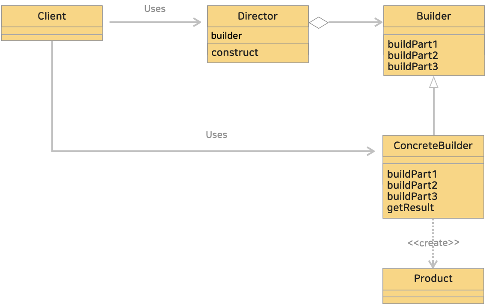

# 7. 빌더 패턴 (Builder Pattern)
> 복합 객체의 생성 과정과 표현 방법을 분리하여 동일한 생성 절차에서 서로 다른 표현 결과를 만들 수 있게 하는 패턴

> 객체를 생성할 때 유연성을 제공하는 디자인 패턴 중 하나로 많은 매개변수를 가진 생성자를 피하고자 할 때 사용된다.
> 객체를 조립하는 방법을 추상화하고, 객체의 생성 과정을 세분화하여 각각의 구성 단계를 나누는데 도움이 된다.
> 
>> 구조를 갖춘 구조물을 건축하거나 구축하는 것을 build(빌드) 라고 하는데, 그 과정을 생각해보면 단숨에 완성하기 보다는 
>> 부분부분 단계를 밟아가며 구축해 나간다. 이처럼 구조를 가진 인스턴스를 만들어가는 것이라하여 Builder 패턴이라 한다. 

<br>

### <예제 프로그램>
Builder 패턴을 사용해 컴퓨터를 구축(빌드)하는 프로그램

| **이름**                                                                                                                         | **내용**                                                           |
|:-------------------------------------------------------------------------------------------------------------------------------|------------------------------------------------------------------|
| [Computer 클래스 (소스보기)](../src/main/java/hello/example/designpattern/builder/computer/Computer.java)                             | 컴퓨터 객체를 나타내는 클래스로 컴퓨터 구축(빌드)에 필요한 부품 정보를 가지고 있다.                 |
| [ComputerBuilder 인터페이스 (소스보기)](../src/main/java/hello/example/designpattern/builder/computer/ComputerBuilder.java)             | 컴퓨터 객체를 생성하기 위한 각 부품의 빌더 인터페이스로 부품들을 설정하는 메소드를 선언한다.             |
| [DesktopComputerBuilder 클래스 (소스보기)](../src/main/java/hello/example/designpattern/builder/computer/DesktopComputerBuilder.java) | ComputerBuilder 인터페이스를 구현하여 실제로 컴퓨터 객체를 생성하고 부품을 설정하는 클래스        |
| [ComputerDirector 클래스 (소스보기)](../src/main/java/hello/example/designpattern/builder/computer/ComputerDirector.java)             | (옵션 클래스) <br/> 객체 생성의 순서를 제어하는 클래스로 일관된 방식으로 객체를 생성할 수 있는 메소드 제공 |
| [ComputerBuilderTest 실행 클래스 (소스보기)](../src/test/java/hello/example/designpattern/builder/computer/ComputerBuilderTest.java)            | 동작 테스트용 클래스                                                      |

Builder 클래스에서 객체를 구성하는 메소드를 결정한다. 각 부분을 만드는 메소드가 준비된다. ComputerBuilder 가 이 역할에 해당한다. <br>
Director 클래스에서 그 메소드를 이용해 구체적인 하나의 객체(컴퓨터)를 만든다. 객체 생성 과정을 클라이언트에서 숨겨 클라이언트가 간단하게 객체를 생성할 수 있도록 한다. <br>
Builder 는 추상 클래스로 추상 메소드만 선언되어 있다. 구체적인 처리는 Builder 의 하위 클래스에서 한다. <br>
* DesktopComputerBuilder 클래스 : 실제로 객체를 생성해주고 부품을 설정해주는 Builder 의 하위(구현) 클래스
* ComputerDirector 클래스 : 클라이언트가 간단하게 객체를 생성할 수 있도록 제공하는 클래스로 옵션의 성격을 띄는 클래스

<br>

### (1) Builder 의 하위 클래스를 모르는 Director 클래스
Director 클래스는 자기 자신이 **실제로 이용**하는 Builder 클래스를 구현한 하위 클래스를 알지 못한다. <br>
그래서 하위클래스가 변경되도 동작할 수 있다. <br>

<br>

### (2) Builder 패턴의 클래스 다이어 그램
</img><br/>

<br>

* Product (제품, 건축대상, 구축대상)
  * 구체적인 빌더에의해 최종적으로 생성되는 실제 대상, 인스턴스
  * [Computer 클래스 (소스보기)](../src/main/java/hello/example/designpattern/builder/computer/Computer.java)
* Builder (빌더, 건축가)
  * 인스턴스(Product)를 생성하기위한 인터페이스를 결정
  * 인스턴스(Product)의 각 부분을 만드는 메소드를 준비
  * [ComputerBuilder 인터페이스 (소스보기)](../src/main/java/hello/example/designpattern/builder/computer/ComputerBuilder.java)
* ConcreteBuilder (구체적인 빌더, 건축가)
  * Builder 의 인터페이스를 구현하는 클래스
  * 실제 인스턴스 생성으로 호출되는 메소드를 정의
  * 완성된 결과를 얻는 메소드도 정의
  * [DesktopComputerBuilder 클래스 (소스보기)](../src/main/java/hello/example/designpattern/builder/computer/DesktopComputerBuilder.java)
* Director (감독, 지시)
  * **Builder 인터페이스만**을 이용해서 인스턴스 생성
  * **ConcreteBuilder 에 의존하지 않도록 한다.** 
  * [ComputerDirector 클래스 (소스보기)](../src/main/java/hello/example/designpattern/builder/computer/ComputerDirector.java)
* Client (이용자)
  * Builder 패턴을 이용
  * 참고로 Gof의 디자인패턴에는 클라이언트가 포함되지 않는다.
  * [ComputerBuilderTest 실행 클래스 (소스보기)](../src/test/java/hello/example/designpattern/builder/computer/ComputerBuilderTest.java) 

<br>

### (3) 의존성 주입 (Dependency Injection)
Director 클래스는 ConcreteBuilder 클래스를 모른다. Builder 인터페이스만 알고있다.
즉, Director 는 ConreteBuilder 에 의존하지 않는다. <br>

하지만, Director 가 실제로 동작하려면 Builder 의 구체적인 인스턴스가 필요하다.
그래서 Director 클래스의 생성자를 호출할 때 구체적인 인스턴스 DesktopComputerBuilder 를 인수로 전달한다. <br>
이렇게 특정 인스턴스를 이용해(의존) 동작하도록 하는 것을 **의존성 주입** 이라 한다. <br>

```java
public class Client {
  public static void main(String[] args) {
    // 구체적인 인스턴스 생성
    ComputerBuilder builder = new DesktopComputerBuilder();
    // 의존성 주입 (DI)
    ComputerDirector director = new ComputerDirector(builder);
    // Director 이용한 구축
    Computer computer = director.construct();
  }
}
```

<br><hr>

## # 정리
### 1. 구조를 가진 인스턴스를 구축해 나가는 Builder 패턴
객체 생성과정을 캡슐화하여 유연하고 가독성 높은 코드를 작성할 수 있도록 도와준다.