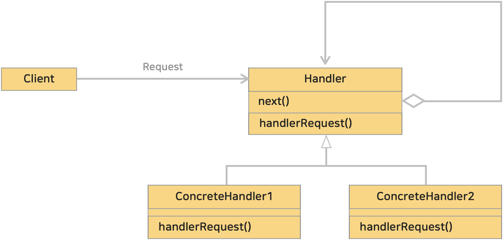
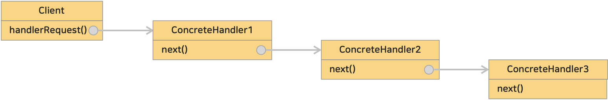

# 14. 책임 연쇄 패턴 (Chain of Responsibility Pattern)
> 여러 객체를 사슬(chain)처럼 연쇄적으로 묶고, 객체 사슬을 차례대로 돌면서 원하는 객체를 결정하는 방법을 이용한 패턴  
> 
> **책임 사슬 패턴** 이라 하기도 한다.
> 
>> 어떤 행사장에서 사회적으로 파장이 일어난 어떤 사건이 발생했다고 하자. A기업이 참여한 행사이지만 A기업은 해당 사건은 경찰소관이니 경찰에게 책임을 물라한다.  
>> 경찰은 해당 행사는 B시에서 주최했으므로 B시 책임이라 하고, B시는 정부부처가 책임이라 한다. 이렇게 '책임 떠넘기기'는 종종 발생한다.  
>> 이렇게 '책임 떠넘기기'는 다소 부정적인 의미가 강하지만, 정말로 '떠넘기기'가 필요한 경우가 있다.  
>> 골절상을 입은 환자가 '내과'에 방문하면 '정형외과'로 가도록 유도해야하듯이 필요한 경우가 있다.

 

### <예제 프로그램>
Chain of Responsibility 패턴을 사용해 Trouble이 발생했을 때 누가 처리할지 정하는 예제

| **역할 **         | **이름**                                                                                                                                                          | **내용**                                |
|:----------------|:----------------------------------------------------------------------------------------------------------------------------------------------------------------|---------------------------------------|
| -               | [Trouble 클래스 (소스보기)](../src/main/java/hello/example/designpattern/chainofresponsibility/yuki/Trouble.java)                                                      | 발생한 트러블을 나타내는 클래스로 트러블 번호(number) 갖는다 |
| Handler         | [Support 클래스 (소스보기)](../src/main/java/hello/example/designpattern/chainofresponsibility/yuki/Support.java)                                                      | 트러블을 해결해주는 추상 클래스                     |
| ConcreteHandler | [NoSupport 클래스 (소스보기)](../src/main/java/hello/example/designpattern/chainofresponsibility/yuki/NoSupport.java)                                                  | Support 구체 클래스 (항상 처리하지 않음)           |
| ConcreteHandler | [LimitSupport 클래스 (소스보기)](../src/main/java/hello/example/designpattern/chainofresponsibility/yuki/LimitSupport.java)                                            | Support 구체 클래스 (지정한 번호 미만의 트러블 처리)    |
| ConcreteHandler | [OddSupport 클래스 (소스보기)](../src/main/java/hello/example/designpattern/chainofresponsibility/yuki/OddSupport.java)                                                | Support 구체 클래스 (홀수 번호 트러블 처리)         |
| ConcreteHandler | [SpecialSupport 클래스 (소스보기)](../src/main/java/hello/example/designpattern/chainofresponsibility/yuki/SpecialSupport.java)                                        | Support 구체 클래스 (틍정 번호 트러블 처리)         |
| Client          | [SupportChainOfResponsibilityTest 실행 클래스 (소스보기)](../src/test/java/hello/example/designpattern/chainofresponsibility/yuki/SupportChainOfResponsibilityTest.java) | 동작 테스트용 클래스 (클라이언트)                   |

 

### ■ Chain of Responsibility 패턴의 클래스 다이어 그램
</img> 

 

* Handler (처리자)
  * 요구를 처리하는 처리자 역할을 하는 인터페이스 혹은 추상 클래스
  * 다름 처리자를 설정하거나 다음 처리자에게 요청을 전달하는 메소드가 포함된다.
  * 예제 : [Support 클래스](../src/main/java/hello/example/designpattern/chainofresponsibility/yuki/Support.java) , 요구를 처리하는 메소드 : support()
* ConcreteHandler (구체적인 처리자)
  * 실제로 요청을 처리하는 역할로 Handler 를 구현
  * 예제 :[NoSupport 클래스](../src/main/java/hello/example/designpattern/chainofresponsibility/yuki/NoSupport.java), [LimitSupport 클래스](../src/main/java/hello/example/designpattern/chainofresponsibility/yuki/LimitSupport.java), [OddSupport 클래스](../src/main/java/hello/example/designpattern/chainofresponsibility/yuki/OddSupport.java), [SpecialSupport 클래스](../src/main/java/hello/example/designpattern/chainofresponsibility/yuki/SpecialSupport.java)
* Client (클라이언트)
  * 요청을 보내는 역할

 

### ■ Chain of Responsibility 패턴의 구조

</img> 

1. 클라이언트는 Handler 에게 요청을 보낸다. 이 요청은 첫번째 핸들러 (ConcreteHandler1) 에게 전달된다.
2. 해당 요청을 처리할 수 있는지 확인하고, 처리할 수 있으면 처리를 수행하고 처리할 수 없다면 다음 처리자(ConcreteHander2) 에게 요청을 전달한다.
3. 이러한 과정이 반복 수행되며 요청을 처리할 수 있는 구체적인 처리자(ConcreteHandler)를 찾을때까지 진행된다.

 

### (1) 클라이언트(Client)와 처리자(ConcreteHandler)가 느슨하게 결합된다.
클라이언트는 첫 번째 처리자에게 처리를 요청하기만 하면 된다. 그러면 그 요청이 연결된 사슬안에서 적절한 처리자에 의해 처리된다.  
**클라이언트가 어떤 처리자가 요청을 처리하는지 알 필요가 없고, 각 처리자는 다음 처리자에대한 참조만 알기 때문에 객체간 결합도가 낮다.**

 

### (2) 동적으로 처리자를 변경하거나 추가할 수 있어 유연성과 확장성이 높다.
Chain of Responsibility 패턴처럼 위임을 통해 처리를 떠넘기면 상황에 따라 ConcreteHandler 를 변경할 수 있다.

 

### (3) 책임 떠넘기기는 처리가 지연될 위험이 있다.
Chain of Responsibility 패턴을 사용해서 처리를 떠넘기다보면 적절한 처리자를 찾는데 시간이 걸릴 수 있다. 비교해서 누가 처리를 할지 지정해두고 요청을 한다면 처리가 빠르다.  
따라서 _Chain of Responsibility 패턴을 사용해서 느슨한 결합으로 유연하게 할지_, *결합도는 높아지지만 처리속도를 우선시 하는지*는 **트레이드오프 문제**이다.

즉, ***요청과 처리자의 관계가 고정적이고 처리속도가 매우 중요한 경우에는 패턴을 사용하지 않는 것이 효과적일 수 있다.***

 

### (4) 요청이 처리되지 않을수도 있다.
책임 사슬에 속한 모든 처리자가 요구된 요청을 처리할 수 없다면 해당 요청은 처리되지 않을수도 있다.