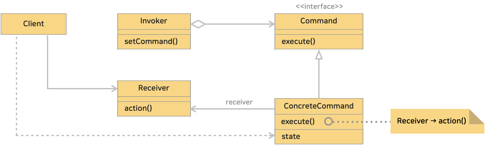

# 22. 커맨드 패턴 (Command Pattern)
> 요청을 객체의 형태로 캡슐화하여 사용자가 보낸 요청을 나중에 이용할 수 있도록 매소드 이름, 매개변수 등 요청에 필요한 정보를 저장 또는 로깅, 취소할 수 있게 하는 패턴이다.
>> 'command'는 '명령'이라는 뜻이다. 이럴 때 '이 일을 처리하라'하고 '명령'을 할 때 메소드 호출이 아니라 하나의 '객체'로 표현할 수 있다.
>> 명령의 집합을 저장해두면 재실행 할 수도 있고, 여러 명령을 모아 새로운 명령으로 재이용할 수도 있을 것이다.

> 요구사항을 객체로 캡슐화 할 수 있으며, 매개변수를 써서 여러 가지 다른 요구 사항을 집어넣을수 있다. 또한 요청 내역을 큐에 저장하거나 로그로 기록할수 도있으며 작업취소 기능도 지원가능 하다.

* 블로그 링크 : [클릭](https://gymdev.tistory.com/22)
* 블로그 관련 소스코드 : [클릭](https://github.com/jmr10200/design-pattern/tree/master/src/main/java/hello/example/designpattern/command)

 

### <예제 프로그램>
Command 패턴을 사용하여 전등을 켜고 끄는 명령으로 표현한 예제

| **역할**          | **이름**                                                                                                               | **내용**                                                                      |
|:----------------|:---------------------------------------------------------------------------------------------------------------------|-----------------------------------------------------------------------------|
| Command         | [Command 인터페이스 (소스보기)](../src/main/java/hello/example/designpattern/command/basic/Command.java)                      | Command 의 인터페이스 정의. execute() 메소드로 명령을 수행한다.                                |
| ConcreteCommand | [LightOnCommand 클래스 (소스보기)](../src/main/java/hello/example/designpattern/command/basic/LightOnCommand.java)          | Command 를 구현한 클래스로 전등을 on 하는 작업을 포함하고 있다.                                   |
| ConcreteCommand | [LightOffCommand 클래스 (소스보기)](../src/main/java/hello/example/designpattern/command/basic/LightOffCommand.java)        | Command 를 구현한 클래스로 전등을 off 하는 작업을 포함하고 있다.                                  |
| Receiver        | [Light 클래스 (소스보기)](../src/main/java/hello/example/designpattern/command/basic/Light.java)                            | LightOnCommand, LightOffCommand 의 명령을 받는다.                                  |
| Invoker         | [RemoteControl 클래스 (소스보기)](../src/main/java/hello/example/designpattern/command/basic/RemoteControl.java)            | 명령을 실행하는 역할로 명령에대한 실제 작업이 이루어진다.   즉, Command 인터페이스의 execute() 메소드를 호출한다. |
| Client          | [RemoteControlTest 실행 클래스 (소스보기)](../src/test/java/hello/example/designpattern/command/basic/RemoteControlTest.java) | 동작 테스트용 클래스 (클라이언트)                                                         |

 

### ■ Command 패턴의 클래스 다이어 그램
</img> 

* Command (커맨드, 명령)
  * Command(명령)의 인터페이스 정의
  * 예제 : [Command 인터페이스](../src/main/java/hello/example/designpattern/command/basic/Command.java)
* ConcreteCommand (구체적인 커맨드, 구체적인 명령)
  * Command 를 구현
  * 예제 : [LightOnCommand 클래스](../src/main/java/hello/example/designpattern/command/basic/LightOnCommand.java), [LightOffCommand 클래스](../src/main/java/hello/example/designpattern/command/basic/LightOffCommand.java)
* Receiver (수신자)
  * Command 가 명령을 실행할 때 대상
  * 명령의 수신자
  * 예제 : [Light 클래스](../src/main/java/hello/example/designpattern/command/basic/Light.java)
* Invoker (호출자)
  * 명령 실행을 시작
  * Command 에 정의된 인터페이스를 호출
  * 예제 : [RemoteControl 클래스](../src/main/java/hello/example/designpattern/command/basic/RemoteControl.java)
* Client (클라이언트)
  * ConcreteCommand 를 생성하고 그때 Receiver 를 할당
  * 예제 : [RemoteControlTest 실행 클래스](../src/test/java/hello/example/designpattern/command/basic/RemoteControlTest.java)

 

### (1) 큐에 명령을 저장할때, 대기열에 넣을때 사용한다.
큐(FIFO구조)에 명령을 넣어 작업들의 실행을 예약하는 등 대기열에 추가하거나 로그(기록)할 수 있다.

 

### (2) 요청을 객체로 만들어 매개변수화 할 때 사용한다.
클라이언트와 서버를 분리하고, 요청을 캡슐화하여 다양한 동작을 지원할 때 사용한다.

 

### (3) 커맨드(명령)의 취소 및 재실행이 요구될 때 사용한다.
명령을 객체로 캡슐화 했기 때문에 명령의 히스토리(로그, 기록)를 저장하고, 취소 및 재실행을 구현할 수 있다.

 

### (4) 개방 폐쇄 원칙 (OCP) 를 준수하여 클라이언트와 서버가 독립적으로 변경될 수 있다.
기존 클라이언트 코드를 변경하지 않고 앱에 새 커맨드(명령)들을 도입할 수 있다.

