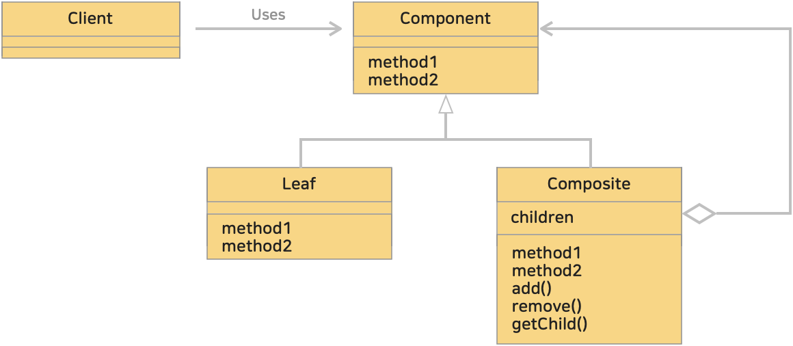

# 11. 컴포지트 패턴 (Composite Pattern)
> 객체들을 트리 구조로 구성하여 개별 객체와 복합 객체를 동일한 방식으로 다룰 수 있게 하는 구조적인 패턴 중 하나 이다.
> 이 패턴은 "전체-부분" 계층 구조를 표현할 때 유용하며, 클라이언트 코드가 단일 객체든 복합 객체든 동일한 인터페이스를 통해 사용할 수 있게 한다.
> 
>> 컴퓨터의 파일 시스템에는 '디렉토리'(폴더라 부르기도 함)가 있다. 디렉토리 안에는 또 다른 디렉토리나 파일이 들어간다.
>>> 디렉토리를 그릇, 파일을 내용물이라 생각하자. 그릇안에 더작은 그릇을 넣을 수 있듯이 디렉토리안에 디렉토리를 넣을 수 있다.
>>
>> 디렉토리는 이렇게 중첩 구조, 재귀적인 구조를 만들어 낸다.  
> 
> 컴포지트 패턴은 이러한 '중첩 구조', '재귀적인 구조'를 만들기 위한 패턴이다.
>> 그릇과 내용물을 동일시하여 재귀적인 구조를 만든다. 
>> composite 란 '혼합물','복합물'이라는 의미로 그릇과 내용물의 중첩된 구조를 생각하면 된다.

 

### <예제 프로그램>
Composite 패턴을 사용해 파일 시스템을 표현하는 프로그램

| **역할**            | **이름**                                                                                                                   | **내용**                                                                                  |
|:------------------|:-------------------------------------------------------------------------------------------------------------------------|-----------------------------------------------------------------------------------------|
| Leaf (노드, 개별 객체)  | [File 클래스 (소스보기)](../src/main/java/hello/example/designpattern/composite/files/File.java)                                | 파일(개별객체, Leaf)을 나타내는 클래스   FileSystemItem 을 구현하는 단일 파일                               |
| Composite (복합 객체) | [Directory 클래스 (소스보기)](../src/main/java/hello/example/designpattern/composite/files/Directory.java)                      | 디렉토리(복합객체, Composite)를 나타내는 클래스   FileSystemItem 을 구현하면서 자식 파일이나 디렉토리를 가질 수 있는 복합 객체 |
| Component (구성 요소) | [FileSystemItem 인터페이스 (소스보기)](../src/main/java/hello/example/designpattern/composite/files/FileSystemItem.java)          | 구성요소(Component)로 디렉토리와 파일을 동일시하기 위한 역할   공통 인터페이스 정의                                 |
| 클라이언트             | [FilesCompositeTest 실행 클래스 (소스보기)](../src/test/java/hello/example/designpattern/composite/files/FilesCompositeTest.java) | 동작 테스트용 클래스   동일한 인터페이스(Component)를 통해 개별객체와 복합객체를 동일하게 다룰 수 있다.                     |

  
 

### (1) 컴포지트 (Composite) 패턴의 클래스 다이어그램
</img> 

* Leaf (잎, 노드, 단일 객체)
  * 복합 객체에서 단일 객체에 해당하는 클래스
  * 복합 객체의 하위 객체가 될 수 없음
  * '내용물'
  * 예제 : [File 클래스 (소스보기)](../src/main/java/hello/example/designpattern/composite/files/File.java)
* Composite (복합 객체)
  * Component를 구현하면서 자식 객체들을 가지고 있는 클래스
  * 자식 객체들에 대한 추가적인 동작 정의 가능
  * '그릇'으로 Leaf 나 Composite 를 넣을 수 있다.
  * 예제 : [Directory 클래스 (소스보기)](../src/main/java/hello/example/designpattern/composite/files/Directory.java)
* Component (구성요소)
  * Leaf 와 Composite 를 동일시하기 위한 역할
  * Leaf (개별 객체)와 Composite (복합 객체)에 대한 공통 인터페이스를 정의 (공통되는 상위 클래스 역할)
  * 예제 : [FileSystemItem 인터페이스 (소스보기)](../src/main/java/hello/example/designpattern/composite/files/FileSystemItem.java)
* Client
  * 예제 : [FilesCompositeTest 실행 클래스 (소스보기)](../src/test/java/hello/example/designpattern/composite/files/FilesCompositeTest.java)

 

### (2) 메소드의 정의는 해당 클래스가 가져야할 책임을 고려해야한다.
예제에서 디렉토리를 추가하는 add() 메소드를 Composite 역할인 Directory 클래스에 정의했다.  
클래스 다이어 그램에서도 자식(children)을 조작하는 메소드들(add(), remove(), getChild())을 Composite 에 정의했다.

만약, 자식을 조작하는 메소드들을 Component 에 정의한다면, 모든 '구체적인 Component' 에서 자식을 조작할 수 있게된다.
Leaf(단일 객체)도 add() 등의 메소드가 추가되버리면서 객체를 가질 수 없는 단일 객체에 객체를 추가할 수 있는 문제가 발생할 수 있다.

***컴포지트 패턴은 클라이언트가 일관된 방식으로 단일 객체(Leaf)와 복합 객체(Composite)를 다룰 수 있도록 하는 것이 핵심***이다.

따라서, 메소드를 정의하는 것은 해당 클래스가 무엇인지, 어떤 책임을 하는지를 명확히 하는 것이므로 주의해야 한다.
