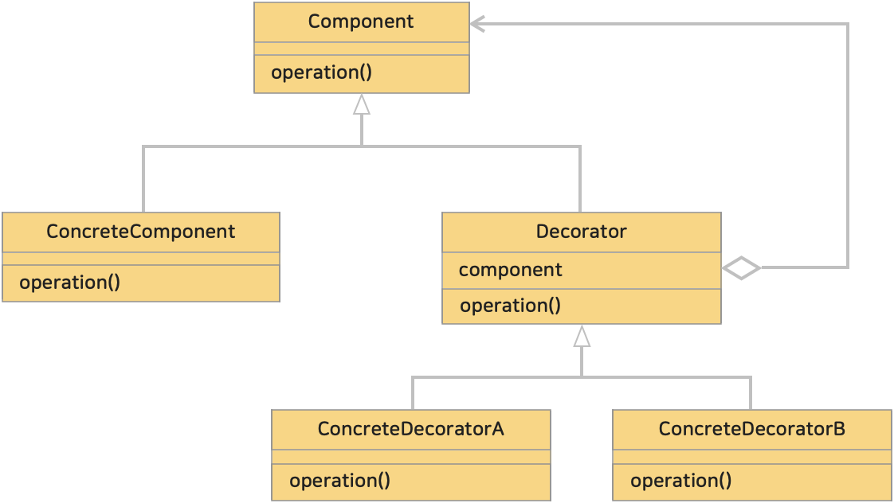

# 12. 데코레이터 패턴 (Decorator Pattern)
> 객체에 기능을 동적으로 확장하거나 수정할 수 있도록 하는 구조적인 패턴이다. <br>
> 데코레이터는 서브클래스를 만드는 것을 통해서 기능을 유연하게 확장할 수 있는 방법을 제공한다.
> 
> 상속을 사용하지 않고도 객체의 행동을 확장할 수 있도록 한다.
> 
>> 에스프레소에 물, 우유, 시럽 등 하나씩 추가하면서 커피를 만들어 나가듯이 객체에 점점 장식을 추가(decorate)히는 것을 데코레이터 패턴이라 한다.

<br>

* 블로그 링크 : [클릭](https://gymdev.tistory.com/15)
* 블로그 관련 소스코드 : [클릭](https://github.com/jmr10200/design-pattern/tree/master/src/main/java/hello/example/designpattern/decorator)

<br><hr>

### <예제 프로그램>
Decorator 패턴을 사용해 샌드위치를 만드는 예제

| **역할**                                     | **이름**                                                                                                                        | **내용**                |
|:-------------------------------------------|:------------------------------------------------------------------------------------------------------------------------------|-----------------------|
| Component (컴포넌트)                           | [Sandwich 인터페이스 (소스보기)](../src/main/java/hello/example/designpattern/decorator/food/Sandwich.java)                            | 샌드위치를 나타내는 컴포넌트 인터페이스 |
| ConcreteComponent (구체적인 컴포넌트)              | [BasicSandwich 클래스 (소스보기)](../src/main/java/hello/example/designpattern/decorator/food/BasicSandwich.java)                    | 기본적인 샌드위치 구현          |
| Decorator (데코레이터)                          | [SandwichDecorator 클래스 (소스보기)](../src/main/java/hello/example/designpattern/decorator/food/SandwichDecorator.java)            | 데코레이터를 나타내는 추상 클래스    |
| Concrete Decorator (구체적인 데코레이터)            | [CheeseDecorator 클래스 (소스보기)](../src/main/java/hello/example/designpattern/decorator/food/CheeseDecorator.java)                | 치즈를 추가하는 데코레이터        |
| Concrete Decorator (구체적인 데코레이터)            | [TomatoDecorator 클래스 (소스보기)](../src/main/java/hello/example/designpattern/decorator/food/TomatoDecorator.java)                | 토마토를 추가하는 데코레이터       |
| 클라이언트                                      | [SandwichDecoratorTest 실행 클래스 (소스보기)](../src/test/java/hello/example/designpattern/decorator/food/SandwichDecoratorTest.java) | 동작 테스트용 클래스           |

* Component (컴포넌트)
  * 기본적인 기능을 정의하는 인터페이스 또는 추상 클래스
  * 예제 : [Sandwich 인터페이스 (소스보기)](../src/main/java/hello/example/designpattern/decorator/food/Sandwich.java)
* ConcreteComponent (구체적인 컴포넌트)
  * Component 를 구현한 실제 객체
  * 동적으로 새로운 기능을 추가하려는 경우 데코레이터를 사용 함
  * 예제 : [BasicSandwich 클래스 (소스보기)](../src/main/java/hello/example/designpattern/decorator/food/BasicSandwich.java)
* Decorator (데코레이터)
  * ConcreteComponent 와 동일한 Component 를 구현
  * ConcreteComponent (구체적인 컴포넌트)를 감싸는 역할
  * 기본적인 기능을 수행하는 ConcreteComponent 에 대한 참조를 가짐
  * 예제 : [SandwichDecorator 클래스 (소스보기)](../src/main/java/hello/example/designpattern/decorator/food/SandwichDecorator.java)
* Concrete Decorator (구체적인 데코레이터)
  * Decorator 를 상속함
  * 추가적인 기능을 제공
  * 여러 개의 데코레이터를 조합하여 여러 층으로 기능을 확정할 수 있음
  * 예제 : [CheeseDecorator 클래스 (소스보기)](../src/main/java/hello/example/designpattern/decorator/food/CheeseDecorator.java),[TomatoDecorator 클래스 (소스보기)](../src/main/java/hello/example/designpattern/decorator/food/TomatoDecorator.java)

<br><br><hr>

### (1) 데코레이터 (Decorator) 패턴의 클래스 다이어그램
</img><br/>

<br>

### (2) 객체의 기능을 동적으로 확장할 수 있다.
**상속 대신에 구성(composition)을 사용하여 기능을 확장하므로 수정에 용이하다.** <br>
구성을 사용한다는 것은 객체를 포함하고 있는(composite) 다른 객체를 사용하여 기능을 확장하거나 재사용하는 방식을 말한다. <br>
다음 코드를 보면 SandwichDecorator 클래스는 Sandwich 클래스를 포함하고 있다. 이를 '구성'이라 한다.

```java
/**
 * Decorator
 *
 * 데코레이터를 나타내는 추상 클래스
 */
public class SandwichDecorator implements Sandwich {

  // 상속 대신 구성(composition)을 사용한다.
  protected Sandwich decoratedSandwich;

  public SandwichDecorator(Sandwich decoratedSandwich) {
    this.decoratedSandwich = decoratedSandwich;
  }

  @Override
  public String getDescription() {
    return decoratedSandwich.getDescription();
  }

  @Override
  public int cost() {
    return decoratedSandwich.cost();
  }
}
```

<br>

### (3) 개방 폐쇄 원칙 (OCP 원칙)을 준수한다.
기존 코드를 수정하지 않고도 새로운 기능을 추가할 수 있으므로, 개방 폐쇄 원칙을 준수한다.

> **개방 폐쇄 원칙 (OCP, Open - Closed Principle)** <br>
> 클래스는 확장에 대해서는 열려 있어야 하지만 변경에 대해서는 닫혀 있어야 한다.
 
<br>

### (4) 순서에 민감하고 복잡할 수 있다.
데코레이터 순서에 따라 결과가 달라질 수 있는 위험이 있고, 과도하게 사용하면 클래스 수가 많아져 복잡해질 수 있다.