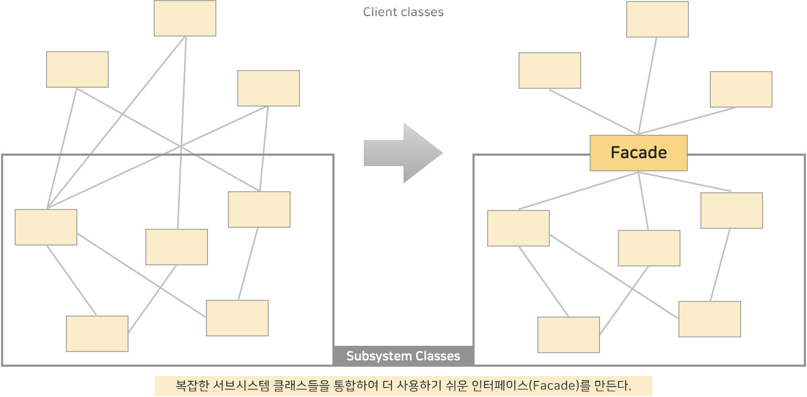
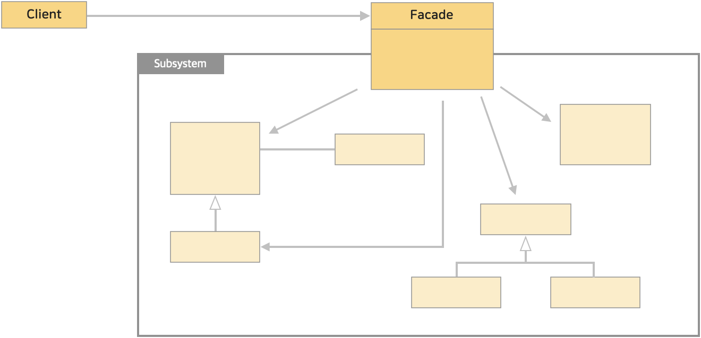

# 15. 파사드 패턴 (Facade Pattern)
> 어떤 서브시스템의 일련의 인터페이스에 대한 통합된 인터페이스를 제공한다. 퍼사드에서 고수준 인터페이스를 정의하기 때문에 서브시스템을 더 쉽게 사용할 수 있다.

 

</img> 

 

* 블로그 링크 : [클릭](https://gymdev.tistory.com/25)
* 블로그 관련 소스코드 : [클릭](https://github.com/jmr10200/design-pattern/tree/master/src/main/java/hello/example/designpattern/facade/audio)

 

### <예제 프로그램>
Facade 패턴을 사용해 컴퓨터를 기동시키는 예

| **역할**    | **이름**                                                                                                               | **내용**                |
|:----------|:---------------------------------------------------------------------------------------------------------------------|-----------------------|
| Subsystem | [Cpu 클래스 (소스보기)](../src/main/java/hello/example/designpattern/facade/computer/Cpu.java)                              | 시스템을 구성하는 서브 클래스 시스템  |
| Subsystem | [HardDiskDrive 클래스 (소스보기)](../src/main/java/hello/example/designpattern/facade/computer/HardDiskDrive.java)              | 시스템을 구성하는 서브 클래스 시스템  |
| Subsystem | [Memory 클래스 (소스보기)](../src/main/java/hello/example/designpattern/facade/computer/Memory.java)                            | 시스템을 구성하는 서브 클래스 시스템  |
| Subsystem | [Power 클래스 (소스보기)](../src/main/java/hello/example/designpattern/facade/computer/Power.java)                              | 시스템을 구성하는 서브 클래스 시스템  |
| Facade    | [ComputerFacade 클래스 (소스보기)](../src/main/java/hello/example/designpattern/facade/computer/ComputerFacade.java)            | 복잡한 서브 시스템들을 구성하는 파사드 |
| Client    | [ComputerFacadeTest 실행 클래스 (소스보기)](../src/test/java/hello/example/designpattern/facade/computer/ComputerFacadeTest.java) | 동작 테스트용 클래스 (클라이언트)   |

 

### ■ Facade 패턴의 클래스 다이어 그램
</img> 

 

* Facade (파사드)
  * 복잡한 서브시스템을 단순화시킨 고수준의 인터페이스를 제공한다.
  * 예제 : [Power 클래스](../src/main/java/hello/example/designpattern/facade/computer/Power.java), [Cpu 클래스](../src/main/java/hello/example/designpattern/facade/computer/Cpu.java), [Memory 클래스](../src/main/java/hello/example/designpattern/facade/computer/Memory.java), [HardDiskDrive 클래스](../src/main/java/hello/example/designpattern/facade/computer/HardDiskDrive.java)
* Subsystem (서브시스템)
  * 전체 시스템을 구성하는 하위 시스템으로 복잡한 로직을 구현한다.
  * 예제 : [ComputerFacade](../src/main/java/hello/example/designpattern/facade/computer/ComputerFacade.java)

 

### (1) Facade 는 복잡한 것을 단순하게 보여주는 것이다.
수많은 서브시스템이 존재하면 어떤 것을 사용해야하는지 어렵고 호출 순서에도 주의해야한다.  
이러한 복잡한 것을 단순하게 보여주어 인터페이스가 단순해진다.

### (2) 클라이언트는 Facade 를 사용하므로 결합이 느슨해진다.
클라이언트는 서브시스템 하나하나를 직접 사용하기보다는 Facade 를 이용하므로 서브시스템이 부품으로서 재사용하기 쉬워진다.  
즉, **느슨한 결합으로 유지보수성이 향상되고 시스템을 확장하거나 변경하기 용이해진다.**

### (3) 간혹 개발자는 Facade 를 만들고 싶어하지 않지만 만들어서 명확하게 코드로 표현해두어야 한다.
숙련된 개발자의 머릿속에는 시스템의 내용이 모두 들어 있어, Facade를 만들지 않고도 용이하게 사용할 수 있다.  
이럴때 개발자는 다 알고 있는데 '귀찮게 굳이 Facade 클래스 하나를 추가해야하나?'하는 생각을 할 수 있다.  
아무리 잘 알고 있더라도 잠깐 사용하지 않으면 까먹어버리기 십상이고, 다른 개발자가 유지보수하게 될 수도 있다. 그러므로 다 알고 있다고 으스댈것이 아니라 **명확하게 코드로 표현**해야한다.