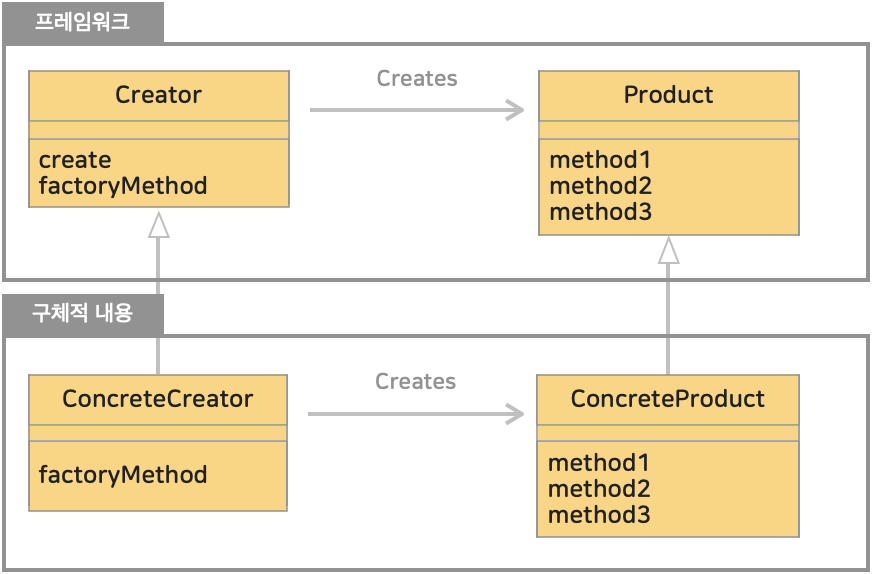

# 4. 팩토리 메소드 패턴 (Factory Method Pattern)
>객체를 생성하기위한 인터페이스를 정의하는데, 어떤 클래스의 인스턴스를 만들어지는 서브클래스에서 정하게 만든다. <br>
>즉, **클래스의 인스턴스를 만드는 일을 서브 클래스에게 맡기는 것**이 팩토리 메소드 패턴이다.

> 템플릿 메소드 (Template Method)에서 상위 클래스에서 처리의 뼈대를 만들고,
> 하위 클래스에서 구체적인 살을 붙였다. 이 패턴을 인스턴스 생성에 적용하는 것이 팩토리 메소드 패턴이다.

* 블로그 링크 : [클릭](https://gymdev.tistory.com/23#section-4)
* 블로그 관련 소스코드 : [클릭](https://github.com/jmr10200/design-pattern/tree/master/src/main/java/hello/example/designpattern/factory/factorymethod)

<br>

### (1) 인스턴스 생성의 뼈대(프레임워크) 역할을 하는 Product, Factory 추상 클래스

* 인스턴스를 생성하는 프레임워크 쪽 (framework 패키지)
  * Product : 제품을 표현, 무엇이든 사용할 수 있는 것을 규정 use()
  * Factory : 공장을 표현, 'create() 메소드로 Product 인스턴스를 생성하는 것', 제품을 만들고 createProduct(), 등록하는 절차 registerProduct() 로 구성 됨
* 구체적인 내용을 구현하는 쪽 (idcard 패키지)
  * IDCard
  * IDCardFactory

<br>

| **패키지**   | **이름**                                                                                                                         | **내용**                                                                                                                        |
|:----------|:-------------------------------------------------------------------------------------------------------------------------------|-------------------------------------------------------------------------------------------------------------------------------|
| framework | [Product 클래스 (소스보기)](../src/main/java/hello/example/designpattern/factory/factorymethod/yuki/framework/Product.java)           | 추상 메소드 use() 정의한 추상 클래스                                                                                                       |
| framework | [Factory 클래스 (소스보기)](../src/main/java/hello/example/designpattern/factory/factorymethod/yuki/framework/Factory.java)           | 메소드 create() 구현한 추상 클래스 <br> Template Method 패턴이 사용됨 <br> -> 추상메소드 createProduct() 로 제품을 만들고, 추상메소드 registerProduct() 로 등록한다. |
| idcard    | [IDCard 클래스 (소스보기)](../src/main/java/hello/example/designpattern/factory/factorymethod/yuki/idcard/IDCard.java)                | 메소드 use() 를 구현한 클래스                                                                                                           |
| idcard    | [IDCardFactory 클래스 (소스보기)](../src/main/java/hello/example/designpattern/factory/factorymethod/yuki/idcard/IDCardFactory.java)  | 메소드 createProduct(), registerProduct() 구현한 클래스                                                                                |
| -         | [IDCardFactoryTest 클래스 (소스보기)](../src/test/java/hello/example/designpattern/factory/factorymethod/yuki/IDCardFactoryTest.java) | 동작 테스트용 클래스                                                                                                                   |


### (2) 뼈대(프레임워크) 에 살을 붙여 구체적으로 구현하는 역할을 하는 IDCard, IDCardFactory 클래스

<br>

### (3) 템플릿 메소드 패턴의 클래스 다이어그램

</img><br/>

#### 1. Product (제품)
- 추상적인 뼈대역할의 프레임워크 쪽
- 생성되는 인스턴스가 가져야 할 인터페이스를 결정하는 추상 클래스
- 예제 : [Product 클래스 (소스보기)](../src/main/java/hello/example/designpattern/factory/factorymethod/yuki/framework/Product.java)
#### 2. Creator (작성자)
- 추상적인 뼈대역할의 프레임워크 쪽, Product 역을 생성하는 추상 클래스
- 인스턴스 생성 메소드 create() 를 호출하면 Product 가 생성된다.
- 예제 : [Factory 클래스 (소스보기)](../src/main/java/hello/example/designpattern/factory/factorymethod/yuki/framework/Factory.java)
- new 를 사용해 실제 인스턴스를 사용하는 대신, 인스턴스 생성 메소드 (createProduct()) 를 호출함으로써 구체적인 클래스 이름에 의한 속박에서 상위 클래스를 자유롭게 한다. (의존성 뒤집기 원칙 준수)

> **의존성 뒤집기 원칙 (Dependency Inversion Principle)** <br>
> 추상화된 것에 의존하도록 만들어라. 구체적인 구현 클래스 (concrete class) 에 의존하도록 만들지 않도록 한다.


#### 3. ConcreteProduct (구체적인 제품)
- 구체적인 내용을 기술하는 하위클래스
- 구체적인 제품(Product) 을 결정
- 예제 : [IDCard 클래스 (소스보기)](../src/main/java/hello/example/designpattern/factory/factorymethod/yuki/idcard/IDCard.java)
#### 4. ConcreteCreator (구체적인 작성자)
- 구체적인 내용을 기술하는 하위클래스
- 구체적인 제품을 만들 클래스를 결정
- 예제 : [IDCardFactory 클래스 (소스보기)](../src/main/java/hello/example/designpattern/factory/factorymethod/yuki/idcard/IDCardFactory.java)

<hr>


## # 정리
### 1. 의존성 뒤집기 원칙 (Dependency Inversion Principle)
예제에서 프레임워크 (framework) 패키지에 해당하는 클래스들은 구체적인 내용이 기술된 idcard 패키지에 의존하지 않는다. <br>
만약 같은 프레임워크를 사용하여 노트북(product)과 노트북 생산공장(factory) 을 만든다고 가정하면, Laptop(ConcreteProduct) 과 LaptapFactory(ConcreteCreator) 만 추가하면 된다.
기존에 존재하는 프레임워크 패키지의 제품(Product) 과 공장(Factory) 을 수정할 필요가 없다. <br>

상위 클래는 하위 클래스에 의존하지 않는다. <br>
(= framework 쪽의 클래스는 하위클래스인 idcard 패키지를 import 하고있지 않다. 즉, new 를 사용하지 않는다.) <br>

이렇게 구체적인 구현 클래스 (create class) 는 추상적인 상위 클래스에 의존하지 않도록 하는 것이 좋다.<br>

정리하면 만들고 있는 클래스가 **바뀔 가능성이 있다면 팩토리 메소드 패턴 같은 기법**을 써서 **변경**될 수 있는 부분을 **캡슐화** 하여야 한다.

### 2. 패턴 이용에서의 커뮤니케이션
Template Method 패턴, Factory Method 패턴은 하나의 클래스만 봐서는 동작을 이해할 수 없다.<br>
상위 클래스에서 동작의 뼈대를 확인하고, 해당 추상 메소드를 실제로 구현하는 클래스의 코드를 확인해야 하기 때문이다.<br>

따라서 유지보수시 설계자의 처음 의도에서 벗어난 수정이 가해질 위험이 있다. 그래서 주석이나 개발 문서등을 통해 디자인 패턴의 명칭과 의도를 기술해두는 것이 좋은 방법이 될 수 있다.

### 3. static Factory Method
인스턴스 생성을 위한 클래스 메소드(static 메소드) 전반을 Factory Method 라고 부르는 경우가 있다. 이는 GoF의 Factory Method 패턴과는 다르지만 java 에서 인스턴스를 생성할 때 매우 자주 사용되는 기법이다. <br>
java API 레퍼런스에서도 인스턴스 생성을 위한 클래스 메소드를 **static Factory Method** 로 표현하기도 한다.<br>

java API 레퍼런스를 확인할 때 참조하는 클래스에 static Factory Method 가 제공되는지 확인하자. 인스턴스 생성시 중요 역할을 할 경우가 많다.<br>
create, newInstance, getInstance 등의 이름이 자주 사용된다. <br>

<br>

> #### * _java.security.SecureRandom_ 의 **_getInstance()_** 메소드는 난수 생성 알고리즘 이름을 지정해서 SecureRandom 인스턴스를 생성하는 static Factory Method 이다.
> ```java
> SecureRandom random = SecureRandom.getInstance("NativePRNG");
> ```

> #### * _java.util.List_ 의 **_of()_** 메소드는 구체적인 요소를 주면 List 인스턴스를 생성하는 static Factory Method 이다.
> ```java
> // "Amy", "Billy", "Carter" 로 구성된 List 인스턴스 생성
> List<String> list = List.of("Amy", "Billy", "Carter");
> ```

> #### * _java.util.Arrays_ 의 **_asList()_** 메소드는 지정된 배열이나 열거한 요소로부터 List 인스턴스를 생성하는 static Factory Method 이다.
> ```java
> String[] arr = {"Amy", "Billy", "Carter"};
> List<String> list1 = Arrays.asList(arr);
> List<String> list2 = Arrays.asList("Amy", "Billy", "Carter");
> ```

> #### * _java.lang.String_ 의 **_valueOf()_** 메소드는 다앙향 형태의 문자열 표현을 얻는 static Factory Method 이다.
> ```java
> // char형 'A'로 String형 "A"를 얻는다.
> String string = String.valueOf('A');
> ```

> #### * _java.time.Instant_ 의 **_now()_** 메소드는 현재 시간을 나타내는 Instant 의 인스턴스를 생성하는 static Factory Method 이다. 생성한 인스턴스가 무엇인지 알기 쉽게 now 으로 표기되어 있다.
> ```java
> Instant instant = Instant.now();
> ```