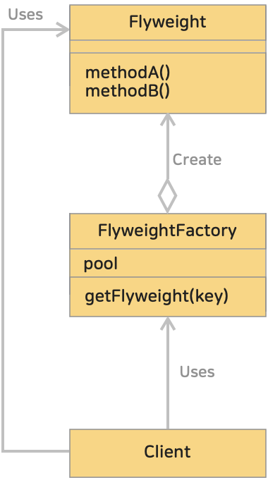

# 20. 플라이웨이트 패턴 (Flyweight Pattern)
> 동일하거나 유사한 객체들 사이에 가능한 많은 데이터를 서로 공유하여 사용하도록 하여 메모리 사용량을 최소화하는 패턴이다.
>> 'flyweight' 란 가벼운 체급인 '플라이급'으로 객체를 **'가볍게'** 만들기 위한 것이다.

java에서는 인스턴스를 생성할때 다음과 같이 new 를 사용해서 객체를 생성한다.
```java
Item item = new Item();
```
이렇게 인스턴스가 생성되면 메모리를 사용하며, 인스턴스가 많이 필요해서 new 를 많이 선언하면 그만큼 메모리를 많이 사용하게 된다.

이런 경우, <u>**'인스턴스를 최대한 공유하여 사용하고 최대한 new 를 사용하지 않도록 하는 것'**</u>이다. 이것이 ***flyweight 패턴의 핵심***이다.

<br><hr>

### <예제 프로그램>
Flyweight 패턴을 사용한 숫자 객체를 공유 하는 예제

| **역할**            | **이름**                                                                                                                  | **내용**                                              |
|:------------------|:------------------------------------------------------------------------------------------------------------------------|-----------------------------------------------------|
| Flyweight         | [Number 인터페이스 (소스보기)](../src/main/java/hello/example/designpattern/flyweight/number/Number.java)                         | 객체들이 공유하는 인터페이스 정의한다. 간단히 숫자를 출력하는 메소드만 정의했다.       |
| ConcreteFlyweight | [ConcreteNumber 클래스 (소스보기)](../src/main/java/hello/example/designpattern/flyweight/number/ConcreteNumber.java)           | Flyweight 인터페이스를 구현한다. 객체의 내부 상태를 표현한다.             |
| FlyweightFactory  | [NumberFactory 클래스 (소스보기)](../src/main/java/hello/example/designpattern/flyweight/number/NumberFactory.java)           | 이미 생성된 객체가 있는지 확인하고, 있다면 해당 객체를 반환하고 없으면 생성하여 반환한다. |
| Client            | [NumberFlyweightTest 실행 클래스 (소스보기)](../src/test/java/hello/example/designpattern/flyweight/number/NumberFlyweightTest.java) | 동작 테스트용 클래스 (클라이언트)                                 |

<br>

### ■ Flyweight 패턴의 클래스 다이어 그램
</img><br/>

* Flyweight (플라이웨이트)
  * 비슷한 객체들이 공유하는 인터페이스를 정의
  * 객체가 가진 상태에 대한 메소드를 제공
  * 예제 : [Number 인터페이스](../src/main/java/hello/example/designpattern/flyweight/number/Number.java)
* ConcreteFlyweight (구체적인 플라이웨이트)
  * Flyweight 인터페이스를 구현
  * 객체가 가지는 내부 상태를 표현 (공유하는 부분을 표현)
  * 예제 : [ConcreteNumber 클래스](../src/main/java/hello/example/designpattern/flyweight/number/ConcreteNumber.java)
* FlyweightFactory (플라이웨이트 팩토리)
  * Flyweight 객체를 관리하고, 클라이언트에게 공유된 Flyweight 객체를 제공하는 역할
  * 객체를 캐시하고 공유하여 중복생성을 방지
  * 예제 : [NumberFactory 클래스](../src/main/java/hello/example/designpattern/flyweight/number/NumberFactory.java)

<br>

### ■ Flyweight 패턴의 동작 과정
1. 클라이언트의 요청
   * 클라이언트가 객체를 생성 또는 요청할 때 FlyweightFactory 에게 요청한다.
2. 팩토리가 객체 생성 또는 반환
   * FlyweightFactory 는 이미 생성된 객체가 있는지 확인하고, 있다면 해당 객체를 반환하고 없으면 생성하여 반환한다.
3. 클라이언트의 사용
   * 클라이언트는 반환된 Flyweight 객체를 사용한다. 이때 객체는 자신이 가진 내부 상태를 가지고있으며, 외부 상태는 클라이언트에서 전달받거나 설정한다.

<br>

### ■ intrinsic (공유하는, 내부 상태) & extrinsic (공유하지않는, 외부 상태)
* ***내부 상태 (intrinsic state)***
  * **공유 가능한 부분**
  * 정의 : 객체가 공유 가능하며 불변(immutable)한 부분
  * 특징 :
    * 여러 객체가 동일한 내부 상태를 가질 수 있다.
    * 한 번 생성된 내부 상태는 변경되지 않고 공유된다.
  * <u>**플라이웨이트 패턴의 공유 가능한 객체에 저장된다.**</u>
* ***외부 상태 (extrinsic state)***
  * **각각 다른 고유한 부분**
  * 정의 : 클라이언트에서 전달되어 특정 상황이나 context 에 맞게 객체의 동작을 변경하는데 사용
  * 특징 :
    * 각 객체마다 다를 수 있다.
    * 클라이언트가 전달하는 부분이다.
    * 외부 상태를 통해 객체의 동작이 동적으로 변할 수 있다.
  * <u>**플라이웨이트 패턴에서 클라이언트에서 전달된다.**</u>


<br><hr>


### (1) 객체 공유로 중복된 메모리 사용을 줄일 수 있다.
내부 상태 (intrinsic) 는 여러 객체가 공유하므로 중복된 메모리 사용을 줄일 수 있다. <br>
new 키워드 사용이 줄어들면 그만큼 자원(리소스)를 절약할 수 있고 이는 속도를 높일 수 있다.

<br>

### (2) '공유하는(intrinsic) 정보'와 '고유한(extrinsic) 정보'를 명확히 구분해야 한다.
Flyweight 패턴은 인스턴스를 공유하는 것이다. 인스턴스를 공유한다는 것은 그 영향이 공유된 모든 곳에 미친다는 의미이다. 
'공유하는 정보'를 변경하면 해당 인스턴스를 사용하고 있는 모든 곳에 영향이 미친다. <br>
따라서 <u>**불변성(immutable)을 유지하기위해 공유가능한 부분(intrinsic) 과 고유한 부분(extrinsic)을 명확히 구분할 필요가 있다.**</u>
