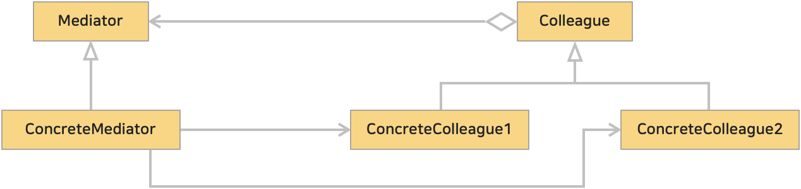

# 16. 중재자 패턴 (Mediator Pattern)
>  객체 간의 상호 작용을 캡슐화하여 객체 간의 직접적인 통신을 방지하고, 중재자 객체를 통해 간접적으로 상호 작용하도록 하는 디자인 패턴이다.
>> 'Mediator'는 '중재자'라는 뜻이다. 그룹의 멤버들이 많아 소통이 원활하지 않을때, '중재자'를 두는 것을 생각하면 된다.  
>> 멤버는 모두 중재자에게만 보고하고, 중재자는 멤버에게 지시를 내리도록 하면 '중재자'를 통해 소통이 원활해지게 된다.

 

### <예제 프로그램>
Mediator 패턴을 사용해 나타낸 간단한 채팅 어플리케이션

| **역할**             | **이름**                                                                                                                | **내용**                                                           |
|:-------------------|:----------------------------------------------------------------------------------------------------------------------|------------------------------------------------------------------|
| Mediator           | [ChatMediator 인터페이스 (소스보기)](../src/main/java/hello/example/designpattern/mediator/chat/ChatMediator.java)             |       |
| Colleague          | [User 클래스 (소스보기)](../src/main/java/hello/example/designpattern/mediator/chat/User.java)                               |            |
| ConcreteMediator   | [ChatRoom 클래스 (소스보기)](../src/main/java/hello/example/designpattern/mediator/chat/ChatRoom.java)                       |         |
| ConcreteColleague  | [ChatUser 클래스 (소스보기)](../src/main/java/hello/example/designpattern/mediator/chat/ChatUser.java)                       |  |
| Client             | [ChatMediatorTest 실행 클래스 (소스보기)](../src/test/java/hello/example/designpattern/mediator/chat/ChatMediatorTest.java) | 동작 테스트용 클래스                                                      |

 

### ■ Mediator 패턴의 클래스 다이어그램
</img> 

* Mediator (중재자, 조정자)
  * 객체간의 상호 작용을 총괄하는 인터페이스 또는 클래스
  * 다른 객체들 간의 통신을 조정하고 관리
  * 예제 : [ChatMediator 인터페이스](../src/main/java/hello/example/designpattern/mediator/chat/ChatMediator.java)
* Concrete Mediator (구체적인 중재자)
  * Mediator 의 인터페이스를 구현
  * 예제 : [ChatRoom 클래스 (소스보기)](../src/main/java/hello/example/designpattern/mediator/chat/ChatRoom.java)
* Colleague (동료)
  * Mediator(중재자)와 통신하는 객체
  * Colleague 는 서로 직접 통신하지 않고 Mediator(중재자)를 통해 간접적으로 통신
  * 예제 : [User 클래스](../src/main/java/hello/example/designpattern/mediator/chat/User.java)
* Concrete Colleague (구체적인 동료)
  * Colleague 의 인터페이스를 구현
  * 예제 : [ChatUser 클래스 (소스보기)](../src/main/java/hello/example/designpattern/mediator/chat/ChatUser.java)

 

### (1) Colleague 들은 중재자를 통해 간접 통신하므로 느슨하게 결합되며 유연성이 증가한다.
Colleague 객체들은 Mediator(중재자)를 통해 간접적으로 통신하기 때문에 객체간의 결합도가 낮아지며 객체 간의 상호 작용을 중재자에게 위임한다.
이로 인해 객체들을 독립적으로 변경하거나 추가하기가 유연해진다.

 

### (2) Mediator 가 통신을 관리하므로 중재자에게 집중되어 부담이 커질수도 있다.
중재자가 전반적인 통신을 담당하므로 부하가 집중될 수 있다. 만약 복잡한 로직을 수행한다면 그 부담은 더 커질수 있다.

 

### (3) [파사드(Facade) 패턴](summary/facade.md)과의 차이
파사드 패턴과 중재자 패턴은 비슷해 보이지만 약간의 차이가 있다.
* 중재자 패턴은 *객체 간의 상호 작용을 중앙 집중화하여 관리*한다.
* 파사드 패턴은 *복잡한 서브시스템에 대한 통합된 인터페이스를 제공*하여 클라이언트가 편리하게 사용할 수 있도록 한다.
* <u>**Mediator 는 양방향**</u>이지만 <u>**Facade 는 단방향**</u>이라고 할 수 있다.