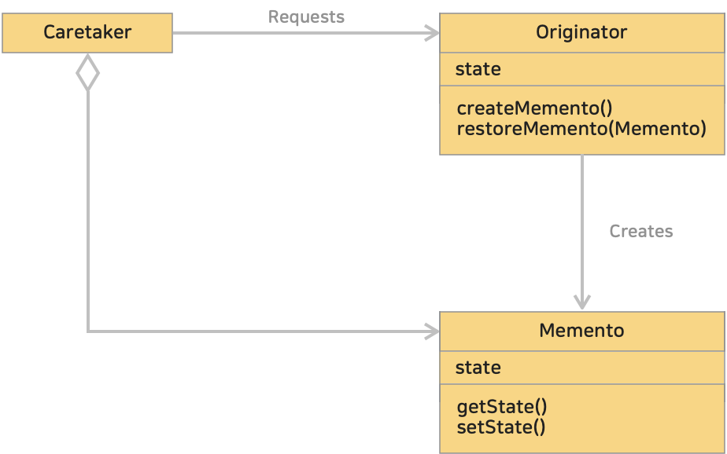

# 18. 메멘토 패턴 (Memento Pattern)
> 객체를 이전 상태로 되돌릴 수 있는 기능을 제공하는 패턴이다.
>> 'Memento' 는 '기념품, 유품, 기억하기위한 물건'이라는 의미이다. '기념품'이나 '여행사진'등을 보면 그 때의 기억이 떠올라 그 때로 간듯한 기분이 든다. <br>
>> 메멘토 패턴은 이와 유사하다. 특정 시점에서 인스턴스 상태를 기록해두고, 나중에 인스턴스를 그 시점의 상태로 되돌려준다.

<br><hr>

### <예제 프로그램>
Memento 패턴을 사용해 게임을 저장하고 불러오는 예제

| **역할**     | **이름**                                                                                                          | **내용**                    |
|:-----------|:----------------------------------------------------------------------------------------------------------------|---------------------------|
| Originator | [Player 클래스 (소스보기)](../src/main/java/hello/example/designpattern/memento/game/Player.java)                      | Player 의 상태를 저장하고 복원하는 클래스 |
| Memento    | [GameStateMemento 클래스 (소스보기)](../src/main/java/hello/example/designpattern/memento/game/GameStateMemento.java)  | 게임 상태를 저장하는 클래스 |
| Caretaker  | [GameCaretaker 클래스 (소스보기)](../src/main/java/hello/example/designpattern/memento/game/GameCaretaker.java)        | 게임 상태를 관리하는 클래스 |
| Client     | [GameMementoTest 실행 클래스 (소스보기)](../src/test/java/hello/example/designpattern/memento/game/GameMementoTest.java) | 동작 테스트용 클래스 (클라이언트) |

<br>

### ■ Memento 패턴의 클래스 다이어 그램
</img><br/>

* Originator (작성자)
  * 자신의 **현재 상태를 저장**하고 싶을 때 Memento 를 만든다.
  * 이전 Memento 를 넘겨 받으면 그 Memento 를 만든 시점의 상태로 되돌린다. **복원**
  * 예제 : [Player 클래스](../src/main/java/hello/example/designpattern/memento/game/Player.java)
* Memento (기념품)
  * Originator 의 **내부 정보(상태)를 저장**한다.
  * 오직 Originator 만 접근 가능하도록 캡슐화되어야 한다.
  * 예제 : [GameStateMemento 클래스](../src/main/java/hello/example/designpattern/memento/game/GameStateMemento.java)
* Caretaker (관리인)
  * Memento 를 **저장하고, 관리**하는 역할을 한다.
  * Memento 를 생성하거나 복원할 필요가 있는 시점에 Originator 에게 요청한다.
  * 예졔 : [GameCaretaker 클래스](../src/main/java/hello/example/designpattern/memento/game/GameCaretaker.java)

<br>

### ■ 동작 과정
1. **Originator 의 상태 저장** : Originator 객체는 자신의 현재 상태를 나타내는 Memento 객체를 생성하고 상태를 저장한다.
2. **Memento 의 관리** : Caretaker 객체가 Memento 를 관리하며, 필요한 경우 Originator 에게 Memento 를 요청하여 저장된 상태를 얻는다.
3. **상태 복원** : Caretaker 가 보유한 Memento 를 사용하여 Originator 의 상태를 이전 상태로 복원한다.

<br>

### ■ wide interface & narrow interface
메멘토는 다음 두 종류의 인터페이스(API)를 가진다.

* wide interface (넓은 인터페이스)
  * 객체의 상태를 되돌리는데 필요한 정보를 모두 얻을 수 있는 메소드 집합
  * 내부 상태를 드러내기 때문에, Originator 가 사용 가능하다.
* narrow interface (좁은 인터페이스)
  * 외부 Caretaker 에게 보여주는 것
  * 내부 상태가 외부에 공개되는 것을 방지한다.

<br><hr>

### (1) Carataker 와 Originator 를 분리함으로 단일책임원칙(SRP)을 준수한다.
Caretaker 는 **어느 시점에 저장할지, 언제 실행취소를 할지 결정**하고 **Memento 를 저장하는 일**을 한다. <br>
Originator 는 **Memento 를 만드는 일**과 주어진 Memento 를 사용하여 **자신의 상태를 되돌리는 일**을 한다. <br>

이렇게 역할을 분리함으로써 단일책임원칙을 지키게 된다.

<br>

### (2) Originator 는 자신의 상태를 캡슐화하여 외부에서 직접 접근하지 못하게한다.

Originator 클래스는 상태를 저장하는 데 필요한 정보를 Memento 클래스로 분리하여 <u>자신의 상태를 Memento 객체로 캡슐화</u>한다.

```java
/** Originator */
class Originator {
  private String state;

  public void setState(String state) {
    this.state = state;
  }

  public String getState() {
    return state;
  }
  // 자신의 상태를 저장하는데 필요한 정보를 Memento 클래스로 분리하여 Memento 객체로 캡슐화
  public Memento saveToMemento() {
    return new Memento(state);
  }
  
  public void restoreFromMemento(Memento memento) {
    this.state = memento.getState();
  }
}
```

Memento 클래스는 <u>Originator 만이 접근할 수 있는 메소드를 제공하여 Originator 내부상태를 캡슐화</u>한다. <br>
Memento 클래스는 Originator 의 상태를 읽을 수는 있지만, 적절한 메소드를 통하지 않으면 상태를 변경할 수 없도록 캡슐화가 구성된다.

```java
/** Memento */
class Memento {
  private final String state;
  // 내부상태 캡슐
  public Memento(String state) {
    this.state = state;
  }
  // 상태는 읽을 수 있지만 변경할 수 없도록 구성
  public String getState() {
    return state;
  }
}
```

Caretaker 는 Memento 객체를 사용하여 상태를 저장하고 복원한다. Memento 객체에 직접 접근하지 않고 필요하다면 Originator 를 통해 Memento 를 관리한다.

```java
/** Caretaker */
class Caretaker {
    private List<Memento> mementos = new ArrayList<>();
    // Memento 객체 이용하여 상태 저장
    public void saveMemento(Memento memento) {
        mementos.add(memento); 
    }
    // Memento 객체 이용하여 상태 복원
    public Memento restoreMemento(int index) {
        return mementos.get(index);
    }
}
```

**캡슐화를 통해 Originator의 상태는 외부로부터 감춰지고, 필요한 경우에만 Memento를 통해 상태를 조작할 수 있게 돤다.**
이로써 **객체의 상태를 안전하게 관리하고 유지보수성을 높일 수 있다.**