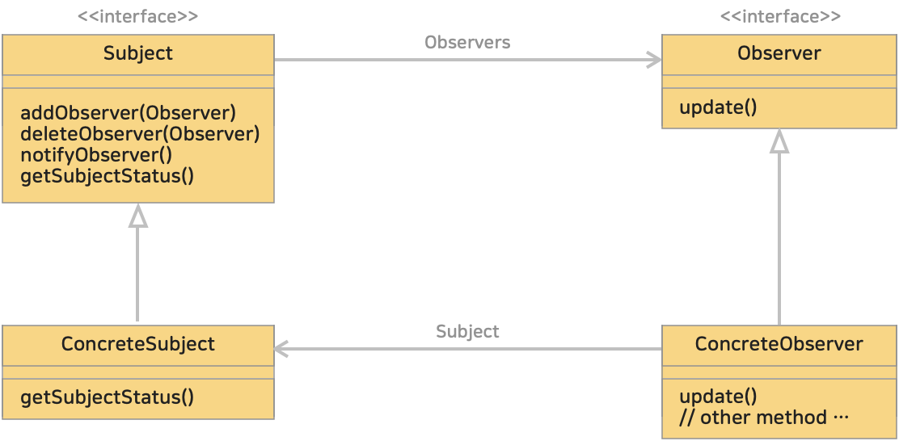

# 17. 옵저버 패턴 (Observer Pattern)
> 한 객체의 상태가 바뀌면 그 객체에 의존하는 다른 객체들한테 연락이가고 자동으로 내용이 갱신되는 방식으로 일대다(one-to-many) 의존성을 정의한다.
>> 'observer'란 '관찰자'라는 뜻이다. 관찰 대상의 상태가 변화하면 관찰자에게 알리고 그에 따른 처리를 할 때 효과적이다.

옵저버 패턴을 구현하는 방법에는 여러가지가 있지만 대부분 주제 (subject) 인터페이스와 옵저버 (observer) 인터페이스가 있는 클래스 디자인을 바탕으로 한다.

</img> 

일대다(1:n) 관계는 주제와 옵저버에 의해 정의된다.

옵저버는 주제에 의존하며, 주제의 상태가 바뀌면 의존하는 옵저버에게 연락이 간다.

* ① **subject** : 상태를 저장하고 있는 주제 인터페이스를 구현한 하나의 주제객체
* ② **observer** : 주제객체에 의존하고 있는 옵저버 인터페이스를 구현한 여러개의 옵저버객체

데이터의 변경이 발생했을 때, 상대 클래스나 객체에 의존하지 않으면서 데이터 변경을 통보할 때 유용하다.
* 블로그 링크 : [클릭](https://gymdev.tistory.com/19)
* 블로그 관련 소스코드 : [클릭](https://github.com/jmr10200/design-pattern/tree/master/src/main/java/hello/example/designpattern/observer)

 

### <예제 프로그램>
Observer 패턴을 사용해 날씨(기온) 변화가 있을때 온도 표시기가 자동으로 업데이트 되는 예제

| **역할**           | **이름**                                                                                                                          | **내용**                                                      |
|:-----------------|:--------------------------------------------------------------------------------------------------------------------------------|-------------------------------------------------------------|
| Subject          | [Subject 인터페이스 (소스보기)](../src/main/java/hello/example/designpattern/observer/forecast/Subject.java)                             | Subject (관찰 대상자, 주제, 주체) 인터페이스                              |
| ConcreteSubject  | [WeatherStation 클래스 (소스보기)](../src/main/java/hello/example/designpattern/observer/forecast/WeatherStation.java)                 | 구체적인 관찰 대상자로 Subject 의 상태가 변경될 때 (기온 변화가 있을 때) 옵저버들에게 알린다.  |
| Observer         | [Observer 인터페이스 (소스보기)](../src/main/java/hello/example/designpattern/observer/forecast/Observer.java)                           | Observer (옵저버) 인터페이스                                        |
| ConcreteObserver | [TemperatureDisplay 클래스 (소스보기)](../src/main/java/hello/example/designpattern/observer/forecast/TemperatureDisplay.java)         | 구체적인 옵저버로 Subject 로부터 상태 변경 알림을 받아 처리한다.                    |
| Client           | [TemperatureObserverTest 실행 클래스 (소스보기)](../src/test/java/hello/example/designpattern/observer/forecast/TemperatureObserverTest.java) | 동작 테스트용 클래스 (클라이언트)                                         |

 

### ■ Observer 패턴의 클래스 다이어 그램
</img> 

* Subject (주제, 주체, 관찰 대상자)
  * 상태가 변경되는 대상
  * 옵저버들을 등록, 삭제하는 메소드를 제공한다.
  * 예제 : [Subject 인터페이스](../src/main/java/hello/example/designpattern/observer/forecast/Subject.java)
* ConcreteSubject (구체적인 관찰 대상자)
  * Subject 의 상태가 변경될 때 옵저버들에게 알리는 역할
  * 예제 : [WeatherStation 클래스](../src/main/java/hello/example/designpattern/observer/forecast/WeatherStation.java)
* Observer (옵저버, 관찰자)
  * Subject 의 상태 변화를 감지하고 업데이트를 수행하는 인터페이스 또는 추상 클래스
  * 에제 : [Observer 인터페이스](../src/main/java/hello/example/designpattern/observer/forecast/Observer.java)
* ConcreteObserver (구체적인 관찰자)
  * 실제로 업데이트를 수행하는 클래스
  * Subject 로부터 상태 변경 알림을 받아 처리한다.
  * 예제 : [TemperatureDisplay 클래스](../src/main/java/hello/example/designpattern/observer/forecast/TemperatureDisplay.java)

 

### ■ 동작 과정
1. **등록 (Register)** : 옵저버는 Subject(관찰대상자)에 등록된다.
2. **알림 (Notify)** : Subject(관찰대상자) 상태가 변경되면 등록된 모든 옵저버에게 알림이 전달된다.
3. **업데이트 (Update)** : 옵저버들은 알림을 받으면 Subject(관찰대상자)의 상태에 따라 업데이트 작업을 수행한다.

 

### (1) Subject 는 Observer 가 옵저버 인터페이스를 구현한다는 것 외에는 모르므로 느슨하게 결합된다.
WeatherStation(ConcreteSubject) 클래스는 자신을 현재 관찰하는 것(자신이 변경될때 알려야 하는 상대)이 구체적으로 어떤 옵저버인지 알지 못한다. 

즉, TemperatureDisplay(ConcreteObserver) 클래스인지, 다른 ConcreteObserver 클래스인지 몰라도 된다.  

<u>결합도가 낮으므로 구체적인 클래스를 부품처럼 쉽게 교환할 수 있게 된다.</u> **-> "느슨한 결합 (Loose Coupling)"**

* 추상 클래스나 인터페이스를 사용하여 구체적으로 구현한 클래스와 **분리**한다.
* 인수로 인스턴스를 저장할 때, 필드로 인스턴스를 저장할 때는 구체적인 클래스가 아니라 **추상 클래스나 인터페이스**로 해 둔다.

 

### (2) MVC (Model View Controller) 구조
MVC 구조에서 **Model 과 View 의 관계**는 Observer 패턴의 **Subject 와 Observer 관계에 대응**한다.