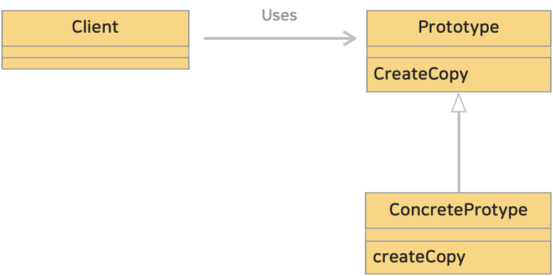

# 5. 프로토타입 패턴 (Prototype Pattern)
> 생성할 객체들의 타입이 프로토타입인 인스턴스로부터 결정되도록 하며, 인스턴스는 새 객체를 만들기 위해 자신을 복제하게 된다.

> 객체를 생성하는 과정이 복잡하거나 생성 비용이 큰 경우, 이미 생성된 객체를 복제하여 새로운 객체를 생성하는 디자인 패턴이다. 
> 이 패턴은 객체의 생성과정을 캡슐화하여 동일한 객체를 여러 번 생성할 때 성능을 향상시키고, 객체 생성에 관련된 복잡한 로직을 캡슐화한다.
>
>> 프로토타입(원래의 형태)의 인스턴스를 바탕으로 새로운 인스턴스를 생성한다.


<br>

### <예제 프로그램>

| **패키지**   | **이름**                                                                                                        | **내용**                                          |
|:----------|:--------------------------------------------------------------------------------------------------------------|-------------------------------------------------|
| framework | [Product 인터페이스 (소스보기)](../src/main/java/hello/example/designpattern/prototype/yuki/framework/Product.java)    | 추상 메소드 use(), createCopy() 가 선언되어 있는 인터페이스      |
| framework | [Manager 클래스 (소스보기)](../src/main/java/hello/example/designpattern/prototype/yuki/framework/Manager.java)      | createCopy() 를 사용하여 인스턴스를 복제하는 클래스              |
| -         | [MessageBox 클래스 (소스보기)](../src/main/java/hello/example/designpattern/prototype/yuki/MessageBox.java)          | 문자열을 테두리문자로 감싸서 표시하는 클래스로 use(), createCopy() 를 구현 |
| -         | [UnderlinePen 클래스 (소스보기)](../src/main/java/hello/example/designpattern/prototype/yuki/UnderlinePen.java)      | 문자열에 밑줄을 그어 표시하는 클래스로 use(), createCopy() 를 구현   |
| -         | [PrototypeTest 실행 클래스 (소스보기)](../src/test/java/hello/example/designpattern/prototype/yuki/PrototypeTest.java) | 동작 테스트용 클래스                                     |

Product 인터페이스와 Manager 클래스는 framework 패키지에 속하며 인스턴스를 복제한다. <br>
Manager 클래스는 createCopy() 메소드를 호출하지만 구체적으로 어느 클래스의 어느 인스턴스를 복제할지 관여하지 않는다. <br>
Product 인터페이스를 구현한 클래스이기만 하면 해당 인스턴스를 복제할 수 있다. <br>

### (1) 복제를 가능하게 하는 Product 인터페이스

java.lang.Cloneable 인터페이스를 상속한 Product 인터페이스는 복제를 가능하게 한다. <br>
* use() 메소드 : '사용'하기 위함 → 그 내용은 하위 클래스에서 구현한다.
* createCopy() 메소드 : 인스턴스를 복제하기 위함

<br>

### (2) Product 인터페이스를 이용해 인스턴스를 복제하는 Manager 클래스
Manager 클래스에서는 다음과 같이 String 형태의 제품명을 key값으로 가지고 value 값은 Product 인터페이스를 구현한 클래스의 인스턴스로하는 대응 관계(Map<String, Product>)를 showcase 라는 필드로 가지고있다. <br>

* register() 메소드 : 제품명(String)과 Product 인터페이스를 주면 showcase 에 등록한다.
* showcase 필드에 제품명과 제품(인스턴스)을 등록(Map.put())해두면 제품명에 대응하는 인스턴스를 취득(Map.get())할 수 있다. 

```java
public class Manager {
    private Map<String, Product> showcase = new HashMap<>();

    public void register(String name, Product prototype) {
        showcase.put(name, prototype);
    }

    public Product create(String prototypeName) {
        Product product = showcase.get(prototypeName);
        return product.createCopy();
    }
}
```
register() 메소드에서 제품명과 Product 인터페이스를 주면 등록하는데, 여기서 인수로 넘어오는 Product 형의 prototype 에 대해서 Manager 클래스는 무엇이 넘어오는지 모른다. <br>
그저 **Product 인터페이스를 구현한 클래스(인스턴스)** 일 뿐이다. <br>

즉, Product 인터페이스를 구현한 MessageBox 클래스 또는 UnderlinePen 클래스 일 것이다. <br>
Manager 클래스는 구체적인 클래스를 모른다. 구체적인 클래스명을 기술하면 그 클래스와 밀접한 관계가 되어 버린다. <br>
이렇게 함으로써 Product 와 Manager 는 구체적 클래스들과 독립적으로 존재하게 된다.

<br>

### (3) Product 인터페이스를 구현하는 구체적인 하위 클래스 : MessageBox, UnderlinePen 클래스
구체적인 하위 클래스는 Product 인터페이스를 구현(implements)한다.

* createCopy() 에서 호출하는 clone() 메소드 
  * java 의 사양으로 규정되어 있는 메소드로 자기 자신의 복제를 생성한다.
  * java.lang.Cloneable 인터페이스를 구현한 클래스를 복제한다.
  * 복제 생성시 인스턴스가 가진 필드 값도 그대로 복제한다.
  * Cloneable 인터페이스를 구현하지 않은 경우 CloneNotSupportedException 발생한다.
  * java 에서 clone() 메소드는 자신 및 하위 클래스에서만 호출할 수 있으므로 다른 클래스의 요청으로 복제할 경우 createCopy() 와 같은 별도 메소드로 감싸줘야 한다.


```java
public class MessageBox implements Product {

    private char decochar;

    public MessageBox(char decochar) {
        this.decochar = decochar;
    }

    @Override
    public void use(String str) {
        int decolen = 1 + str.length() + 1;
        for (int i = 0; i < decolen; i++) {
            System.out.print(decochar);
        }
        System.out.println();
        System.out.println(decochar + str + decochar);

        for (int i = 0; i < decolen; i++) {
            System.out.print(decochar);
        }
        System.out.println();
    }

    @Override
    public Product createCopy() {
        Product product = null;
        try {
            product = (Product) clone();
        } catch (CloneNotSupportedException e) {
            e.printStackTrace();
        }
        return product;
    }
}
```

<br>

### (4) prototype 패턴의 클래스 다이어그램
</img><br/>

* Prototype (프로토타입, 원래의 형태)
  * 인스턴스를 복제하여 새로운 인스턴스를 만들기 위한 메소드 createCopy() 선언
  * [Product 인터페이스](../src/main/java/hello/example/designpattern/prototype/yuki/framework/Product.java)
* ConcretePrototype (구체적인 형태)
  * 인스턴스를 복제하여 새로운 인스턴스를 만드는 메소드 createCopy() 를 구현
  * [MessageBox 클래스](../src/main/java/hello/example/designpattern/prototype/yuki/MessageBox.java)
  * [UnderlinePen 클래스](../src/main/java/hello/example/designpattern/prototype/yuki/UnderlinePen.java)
* Client (이용자)
  * 인스턴스를 복제하는 메소드를 이용해 새로운 인스턴스 생성
  * [Manager 클래](../src/main/java/hello/example/designpattern/prototype/yuki/framework/Manager.java)


<hr>


## # 정리
### 1. Prototype 패턴이 유용한 경우
#### (1) 객체 생성과정이 복잡한 경우
* 객체 생성이 복잡하거나 생성자의 인자가 많은 경우, 이를 복제하여 새로운 객체를 생성하는 것이 더 효율적이다. 복잡한 초기화 로직이나 설정이 필요한 객체를 매번 생성하는 것은 번거로울 수 있다.
#### (2) 성능 향상
* 동일한 객체를 여러 번 생성해야할 경우, 매번 새로 생성하면 비용이 많이 발생한다. 이때 기존에 생성된 객체를 복제하여 사용하면 객체 생성 비용을 줄일 수 있다.
#### (3) 프레임워크와 생성하는 인스턴스를 분리하고 싶은 경우
* 인스턴스를 생성하는 프레임워크를 특정 클래스에 의존하지 않게 하고 싶은 경우, 클래스 이름을 지정해서 인스턴스를 만드는 것이 아니라, 미리 프로토타입(원래의 형태)의 인스턴스를 등록해두고 등록된 인스턴스를 복사해 생성할 수 있다.
#### (4) 동일한 객체의 독립성 유지할 때
* 객체를 복제하면 원본 객체와 복제 객체는 서로 독립적인 인스턴스가 된다. 이는 객체간의 결합도를 낮추고 의도치 않은 부작용을 방지하는데 도움을 준다.
#### (5) 프로토타입(원래 형태)의 인스턴스 공유
* 여러 객체가 공통된 프로토타입을 공유하면 객체 상태를 변경하더라도 다른 객체에 미치는 영향을 최소화하면서 동일한 초기 상태를 공유할때 유용하다.
#### (6) 클래스 계층 구조에서의 확장
* 클래스 계층 구조에서 새로운 클래스를 추가할 경우, 기존 클래스의 인스턴스를 복제하여 새로운 클래스의 인스턴스를 생성하는 것이 유용하다. 클래스 추가에의해 발생하는 초기화 과정을 최소화하고 코드 중복을 피할 수 있기 때문이다.


### 2. 결합도를 낮추게 도와준다.
객체지향 프로그래밍의 목표 중 하나는 '부품으로 재사용' 하는 것이다. <br>
클래스에서 이용할 특정 클래스를 기술하는것이 항상 안좋은 것은 아니다. 하지만, 특정 클래스가 기술되어 있으면 해당 클래스와 분리해서 사용할 수 없게된다. <br>
서로 의존하지 않을수록 결합도가 낮다고 표현한다.

클래스(.class) 파일만 있어도 그 클래스를 재사용할 수 있는것이 객체지향적이다.