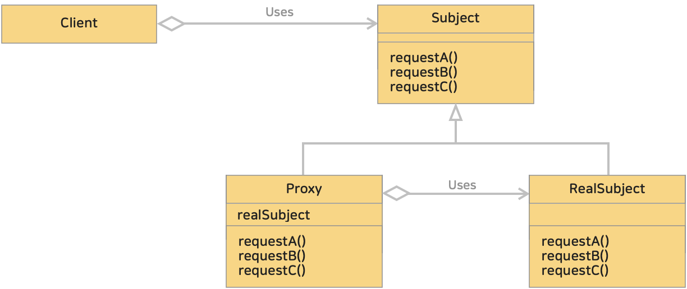

# 21. 프록시 패턴 (Proxy Pattern)
> 어떤 객체에 대한 접근을 제어하기 위한 용도로, 대리인이나 대변인에 해당하는 객체를 제공하는 패턴이다.
> 
> 프록시 패턴을 사용하면 원격 객체라든가 생성하기 힘든 객체, 보안이 중요한 객체와 같은 다른 객체에 대한 접근을 제어하는 대변자 객체를 만들 수 있다.
>
>> 'proxy'란 '대리인'이라는 뜻이다. 어떤 일을 대신 해주는 역할을 하듯이 객체 사이에서 대리자 역할을 하는 객체가 대신 일을 수행하는 것이다.

* 블로그 링크 : [클릭](https://gymdev.tistory.com/63)
* 블로그 관련 소스코드 : [클릭](https://github.com/jmr10200/design-pattern/tree/master/src/main/java/hello/example/designpattern/proxy/basic)

 

### <예제 프로그램>
Proxy 패턴을 사용하여 디스크로부터 이미지 로딩하는 작업 표현

| **역할**      | **이름**                                                                                                          | **내용**                                                 |
|:------------|:----------------------------------------------------------------------------------------------------------------|--------------------------------------------------------|
| Subject     | [Image 인터페이스 (소스보기)](../src/main/java/hello/example/designpattern/proxy/cache/Image.java)                     | 프록시와 실제 객체가 구현해야할 공통 인터페이스(이미지 표시)를 정의하고있다.            |
| RealSubject | [RealImage 클래스 (소스보기)](../src/main/java/hello/example/designpattern/proxy/cache/RealImage.java)                 | 실제 객체로 핵심 로직(이미지 표시) 구현되어 있다.                          |
| Proxy       | [CachingProxyImage 클래스 (소스보기)](../src/main/java/hello/example/designpattern/proxy/cache/CachingProxyImage.java) | 캐시에 이미지가 없으면 생성하고 캐시에 저장후 표시하고 있으면 캐시에있는 이미지를 바로 표시한다. |
| Client      | [ImageProxyTest 실행 클래스 (소스보기)](../src/test/java/hello/example/designpattern/proxy/cache/ImageProxyTest.java)    | 동작 테스트용 클래스 (클라이언트)                                    |

 

### ■ Proxy 패턴의 클래스 다이어 그램
</img> 

* Subject (본인, 주체)
  * Proxy(프록시)와 RealSubject(실제 객체)가 구현해야하는 공통 인터페이스 또는 추상 클래스
  * Subject 덕분에 클라이언트는 Proxy 와 RealSubject 차이를 알 필요가 없다.
  * 예제 : [Image 인터페이스](../src/main/java/hello/example/designpattern/proxy/cache/Image.java)
* Proxy (대리인)
  * RealSubject 에 대한 접근을 제어하거나 부가적인 기능을 수행하는 객체
  * Subject 를 구현하며, RealSubject 에 대한 참조를 가진다.
  * 예제 : [CachingProxyImage 클래스](../src/main/java/hello/example/designpattern/proxy/cache/CachingProxyImage.java)
* RealSubject (실제 본인, 실제 주체)
  * Proxy 가 대리하는 실제 객체
  * 프록시 패턴에서의 핵심 로직이 구현되는 객체
  * 예제 : [RealImage 클래스](../src/main/java/hello/example/designpattern/proxy/cache/RealImage.java)

 

### ■ Proxy 패턴의 종류
1. 가상 프록시 (Virtual Proxy)
   * 실제 객체의 생성이나 초기화에 큰 비용이 드는 경우, 객체가 실제로 필요한 시점까지 생성을 지연시키는 역할을 하는 프록시
2. 보호 프록시 (Protection Proxy, Access Proxy)
   * 객체에 대한 접근을 제어하여 보안 관리에 활용하는 프록시
   * 클라이언트의 요청이나 권한을 확인하고 유효한 요청일때 실제 객체에 대한 접근을 허용한다.
3. 원격 프록시 (Remote Proxy)
   * 객체가 다른 주소에 존재하는 경우, 원격지에서 객체에 접근할수 있도록 하는 프록시
   * 네트워크 통신을 통해 실제 객체와 통신하는 역할을 수행
   * Java RMI(Remote Method Invocation: 원격 메소드 호출) 가 해당한다.
4. 캐싱 프록시 (Caching Proxy)
   * 결과를 캐싱하여 동일한 요청에 대해 중복된 작업을 방지하고 성능을 향상시키는 프록시
   * 요청 결과가 캐시에 저장되어있으면 바로 반환하고, 아니면 실제 객체에 요청하여 반환한다.

 

### ■ Proxy 패턴의 동작 과정
1. 클라이언트가 프록시 객체를 통해 실제 객체에 접근한다.
2. 프록시는 클라이언트 요청에 따라 실제 객체에 대한 접근을 제어하거나 부가적인 작업을 수행한다.
3. 실제 객체가 필요한 시점에 프록시는 실제 객체를 생성하거나 참조를 전달하여 작업을 수행한다.

 

### (1) Gof 디자인 패턴에서는 의도(intent) 에따라 프록시 패턴과 데코레이터 패턴으로 구분한다.
* 프록시 패턴 : 접근 제어가 목적
* [데코레이터 패턴](summary/decorator.md) : 부가가능 추가가 목적

 

### (2) 프록시의 주요 기능
* 접근 제어
  * 권한에 따른 접근 차단 : 접근을 제어하여 보안 및 권한 관리에 활용할 수 있다.
  * 캐싱 : 동일한 요청에 대해 중복된 작업을 방지하고 성능을 향상시킬 수 있다.
  * 지연로딩 : 객체의 생성 또는 초기화를 필요한 시점까지 지연시켜 성능을 향상시킬 수 있다.