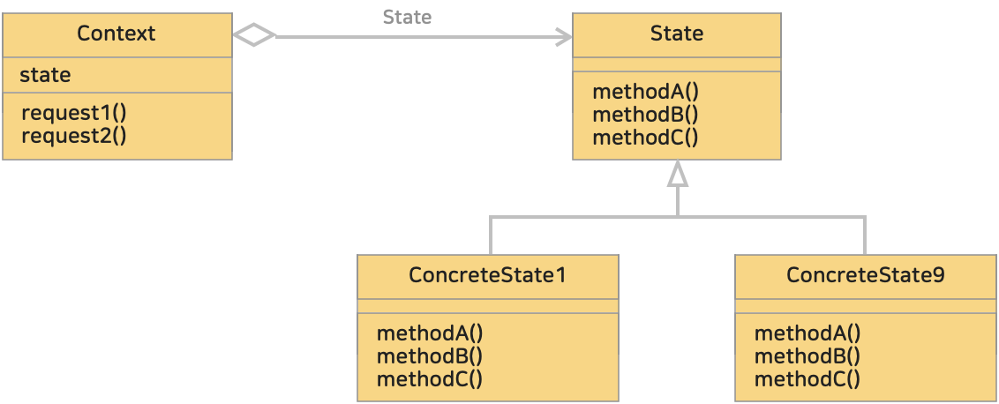

# 19. 상태 패턴, 스테이트 패턴 (State Pattern)
> 객체의 내부 상태가 바뀜에 따라서 객체의 행동을 바꿀 수 있게 한다. 마치 객체의 클래스가 바뀌는 것과 같은 결과를 얻을 수 있다.
>> '상태(state)' 를 '클래스'로 표현한다. 클래스를 전환함으로써 '상태 변화'를 나타낼 수 있다.

> State 패턴은 객체의 내부 상태가 바뀜에 따라 객체의 행동을 변경할 수 있게 하는 패턴으로,
> 상태를 캡슐화하고 이를 통해 객체가 어떤 상태에 있는지에 따라 행동이 달라지도록 한다.

<br>

* 블로그 링크 : [클릭](https://gymdev.tistory.com/26)
* 블로그 관련 소스코드 : [클릭](https://github.com/jmr10200/design-pattern/tree/master/src/main/java/hello/example/designpattern/state)

<br><hr>

### <예제 프로그램>
State 패턴을 사용해 표현한 TV를 켜고 끄는 동작 예제

| **역할**        | **이름**                                                                                                            | **내용**                                 |
|:--------------|:------------------------------------------------------------------------------------------------------------------|----------------------------------------|
| State         | [State 인터페이스 (소스보기)](../src/main/java/hello/example/designpattern/state/appliances/State.java)                    | State(상태) 에서의 인터페이스 정의 (TV 동작 정의)      |
| ConcreteState | [TvOnState 클래스 (소스보기)](../src/main/java/hello/example/designpattern/state/appliances/TvOnState.java)              | State 를 구현, TV가 *켜져있는* 상태에서의 행동 구현     |
| ConcreteState | [TvOffState 클래스 (소스보기)](../src/main/java/hello/example/designpattern/state/appliances/TvOffState.java)            | State 를 구현, TV가 *꺼져있는* 상태에서의 행동 구현     |
| Context       | [TvContext 클래스 (소스보기)](../src/main/java/hello/example/designpattern/state/appliances/TvContext.java)              | State 객체를 가지고 있으면서 현재 상태에 따라 상태 변화를 정의 |
| Client        | [TvStateTest 실행 클래스 (소스보기)](../src/test/java/hello/example/designpattern/state/appliances/TvStateTest.java)       | 동작 테스트용 클래스 (클라이언트)                    |

<br>

### ■ State 패턴의 클래스 다이어 그램
</img><br/>

<br>

* State (상태)
  * 특정 상태에서의 인터페이스를 정의 (특정 상태에서의 동작을 캡슐화)
  * Context 에서 사용되는 (상태에 의존한 동작을 하는) 메소드들을 선언
  * 예제 : [State 인터페이스](../src/main/java/hello/example/designpattern/state/appliances/State.java)
* ConcreteState (구체적인 상태)
  * State 에 정의된 인터페이스를 구현한 구체적인 상태 객체
  * 예제 : [TvOnState 클래스](../src/main/java/hello/example/designpattern/state/appliances/TvOnState.java), [TvOffState 클래스](../src/main/java/hello/example/designpattern/state/appliances/TvOffState.java)
* Context (문맥, 상황)
  * 현재 상태를 나타내는 ConcreteState 객체를 가진다.
  * 현재 상태에 따라 다르게 동작한다.
  * State 패턴 이용자에게 필요한 인터페이스를 정의
  * 예제 : [TvContext 클래스](../src/main/java/hello/example/designpattern/state/appliances/TvContext.java)

<br>

### ■ State 패턴의 동작 과정
1. **Context 는 현재 객체를 가지고 있다.** 
   * Context 는 State 인터페이스를 구현한 구체적인 상태 객체를 가지고 있다.
2. **현재 상태에 따라 다르게 동작한다.**
   * Context 는 자신의 메소드를 호출할 때 현재 상태 객체에게 책임을 위임한다.
3. **상태 전환은 상태 객체에 의해 이루어진다.**
   * State 패턴은 상태 전환을 상태 객체에 위임하여 Context 는 상태 변경에 대해 자세히 알 필요가 없다.

<br><hr>

### (1) 새로운 상태를 추가하거나 기존 상태의 동작을 변경하기 쉽다.
예제 프로그램처럼 State 인터페이스를 구현한 XxxState 클래스를 만들고, 필요한 메소드를 구현하면 새로운 상태를 쉽게 추가할 수 있다.
```java
/** ConcreteState 추가는 간단하다. */
public class TvOnNetflixState implements State {
  @Override
  public void turnOn() {
    System.out.println("TV 에 Netflix 가 실행되어 있습니다.");
  }

  @Override
  public void turnOff() {
    System.out.println("TV 에서 Netflix 를 종료합니다.");
  }
}
```

만약, 음량을 증가시키는 upSound() 기능을 추가한다고 가정해보자.
State 인터페이스에 upSound() 메소드를 추가하고, 각 ConcreteState 클래스에서 구현하면 된다. <br>
<u>클래스가 많아 구현을 놓쳤다고 하더라도 **컴파일할 때 에러가 발생**할 것으로 알려줄 것이다.</u>

```java
/** State 인터페이스 */
public interface State {
    void turnOn();
    void turnOff();
    void upSound(); // 기능 추가
}
/** ConcreteState 클래스 */
public class TvOnState implements State {
    
    // turnOn(), turnOff() 생략..
  
    @Override
    public void upSound() {
        System.out.println("TV 소리를 키웁니다.");
    }
}
```

이러한 패턴을 사용하지않고 각 클래스마다 메소드를 작성해야 한다면 컴파일과정에서 에러가 발생하지 않는다.
***실행할 때 (런타임) 에러가 발생할 가능성이 크고 검출하기 어려워진다.***

<br>

### (2) 객체의 행동아 상태에 의존하는 경우 유용할 수 있다.
State 패턴에서 '상태에 의존하는 처리'를 표현하는 방법은 다음과 같다.

* 추상 메소드로 선언하고 인터페이스로 한다.
* 구상 메소드로 구현하고 개별 클래스로 한다.

<br>

### (3) 상태 전환 관리가 어려울 수 있다.
상태 전환에 대한 로직이 Context 나 Client 에게 위임되기때문에 관리하기 어려울 수 있다.