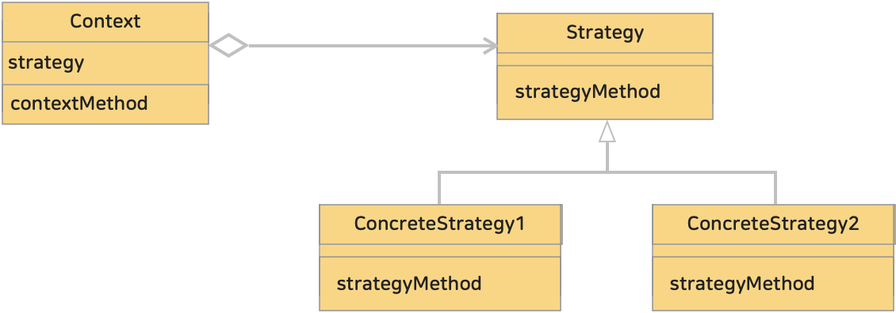

# 10. 전략 패턴, 스트래티지 패턴 (Strategy Pattern)
> 알고리즘군을 정의하고 각각 캡슐화하여 교환해서 사용할 수 있도록 만든다. 스트래티지 패턴을 활용하면 알고리즘을 사용하는 클라이언트와는 독립적으로 알고리즘을 변경할 수 있다.
> 
>> 'strategy'란 '전략'이라는 의미이다. '어떠한 문제를 해결하는 방법'이라는 의미이다. 
>> 어떠한 문제에 대해 그에 알맞는 strategy(전략, 작전, 방안, 행동) 을 바꿔서 해결하기 쉽게 만들어 주는 패턴이다.
> 
>> 전략 패턴은 변하지 않는 부분을 Context (문맥) 라는 곳에 두고, 변하는 부분을 Strategy 라는 인터페이스를 만들고 해당 인터페이스를 구현하도록 해서 문제를 해결한다.  
>> Context 의 내부 필드에 Strategy 를 주입해서 사용한다. 상속이 아니라 **위임으로 문제를 해결**한다.

 

* 블로그 링크 : [클릭](https://gymdev.tistory.com/12)
* 블로그 관련 소스코드 : [클릭](https://github.com/jmr10200/design-pattern/tree/master/src/main/java/hello/example/designpattern/strategy)

 

### <예제 프로그램>
Strategy 패턴을 사용해 고객 등급에 맞는 할인을 적용하는 결제 시스템.

| **역할**                     | **이름**                                                                                                                       | **내용**                                                   |
|:---------------------------|:-----------------------------------------------------------------------------------------------------------------------------|----------------------------------------------------------|
| Strategy (전략)              | [DiscountStrategy 인터페이 (소스보기)](../src/main/java/hello/example/designpattern/strategy/discount/DiscountStrategy.java)         | 전략 인터페이스                                                 |
| ConcreteStrategy (구체적인 전략) | [RegularDiscount 클래스 (소스보기)](../src/main/java/hello/example/designpattern/strategy/discount/RegularDiscount.java)            | 전략 인터페이스를 실제로 구현   비회원은 할인 미적용                        |
| ConcreteStrategy (구체적인 전략) | [MemberDiscount 클래스 (소스보기)](../src/main/java/hello/example/designpattern/strategy/discount/MemberDiscount.java)              | 전략 인터페이스를 실제로 구현   회원은 10% 할인 적용                      |
| ConcreteStrategy (구체적인 전략) | [VipDiscount 클래스 (소스보기)](../src/main/java/hello/example/designpattern/strategy/discount/VipDiscount.java)                    | 전략 인터페이스를 실제로 구현   VIP는 20% 할인 적용                     |
| Context (문맥)               | [PaymentProcessor 클래스 (소스보기)](../src/main/java/hello/example/designpattern/strategy/discount/PaymentProcessor.java)          | Strategy (전략) 객체를 소유   클라이언트가 전략을 변경하거나 사용할 수 있도록 한다. |
| 클라이언트                      | [DiscountStrategyTest 실행 클래스 (소스보기)](../src/test/java/hello/example/designpattern/strategy/discount/DiscountStrategyTest.java) | 동작 테스트용 클래스   클라이언트는 실행 시점에 전략을 선택                    |

  

### (1) 전략 (Strategy) 패턴의 클래스 다이어그램
</img> 

* Strategy (전략)
  * 전략을 이용하기위한 인터페이스를 결정
* ConcreteStrategy (구체적인 전략)
  * Strategy 역의 인터페이스(메소드)를 실제로 구현
  * 구체적인 전략을 실제로 구현
* Context (문맥)
  * Strategy (전략)를 이용
  * ConcreteStrategy 인스턴스를 가지고 있다가 필요에 따라 이용

 

### (2) 위임이라는 느슨한 결합을 사용하여 전략을 용이하게 전환할 수 있다.
Strategy 패턴에서는 실제 알고리즘(구현)을 위임을통해 의도적으로 분리한다.  
위임이라는 느슨한 결합을 사용하면 Strategy 의 인터페이스(메소드)를 변경하지 않고 ConcreteStrategy 만 수정하여 쉽게 전환할 수 있다.

 

### (3) 동적으로 알고리즘 변경도 가능하다.
프로그램 실행 중에 ConcreteStrategy 를 교체할수 있다.