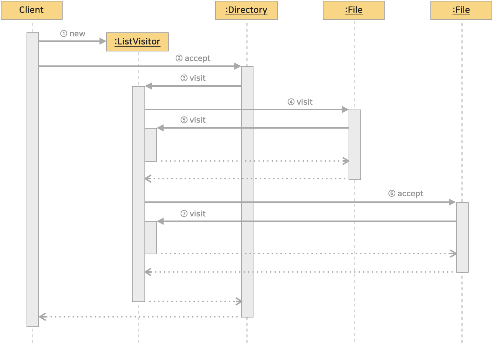
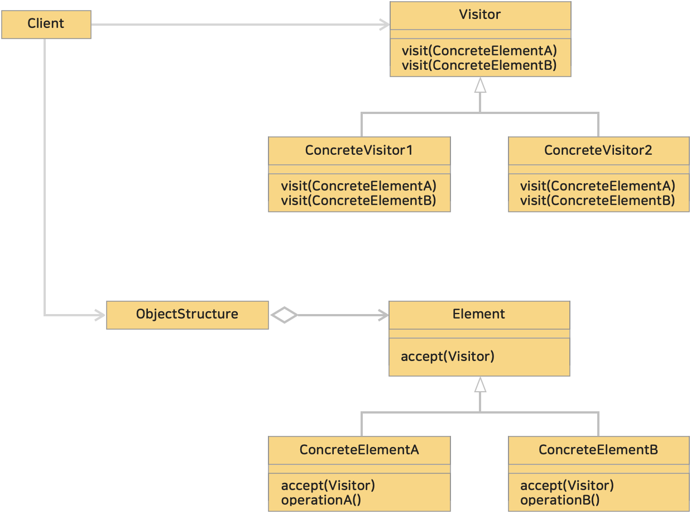

# 13. 방문자 패턴 (Visitor Pattern)
> 알고리즘을 객체 구조에서 분리시키는 디자인 패턴이다. <br>
> 데이터 구조와 처리를 분리하는 것이다.
>> 'visitor'는 방문자 라는 의미로 데이터 구조를 방문하고 다니는 주체인 '방문자'를 나타내는 클래스를 준비하고 그 클래스에 처리를 맡기는 것이다.

<br><hr>

### <예제 프로그램>
Visitor 패턴을 사용해 파일과 디렉토리 구조를 표현

| **이름**                                                                                                            | **내용**                                                   |
|:------------------------------------------------------------------------------------------------------------------|----------------------------------------------------------|
| [Visitor 클래스 (소스보기)](../src/main/java/hello/example/designpattern/visitor/yuki/Visitor.java)                      | 파일이나 디렉토리를 방문하는 방문자를 나타내는 추상 클래스                         |
| [Element 인터페이스 (소스보기)](../src/main/java/hello/example/designpattern/visitor/yuki/Element.java)                    | Visitor 클래스의 인스턴스를 받아들이는 데이터 구조를 나타내는 인터페이스              |
| [ListVisitor 클래스 (소스보기)](../src/main/java/hello/example/designpattern/visitor/yuki/ListVisitor.java)              | Visitor 클래스의 하위 클래스로 파일이나 디렉토리 목록을 표시하는 클래스              |
| [Entry 클래스 (소스보기)](../src/main/java/hello/example/designpattern/visitor/yuki/Entry.java)                          | File 과 Directory 의 상위 클래스가 되는 추상 클래스 (Acceptor 인터페이스 구현) |
| [File 클래스 (소스보기)](../src/main/java/hello/example/designpattern/visitor/yuki/File.java)                            | 파일을 나타내는 클래스                                             |
| [Directory 클래스 (소스보기)](../src/main/java/hello/example/designpattern/visitor/yuki/Directory.java)                  | 디렉토리를 나타내는 클래스                                           |
| [EntryVisitorTest 실행 클래스 (소스보기)](../src/test/java/hello/example/designpattern/visitor/yuki/EntryVisitorTest.java) | 동작 테스트용 클래스(클라이언트)                                       |

<br>

##### ■ 예제의 시퀀스 다이어그램

</img><br/>
(참고) **<u>:Directory</u>** 와 같이 클래스명에 콜론과 함께 밑줄이 그어진 것은 ***해당 클래스의 인스턴스***를 의미한다.

<br>

##### ■ 설명

① [Client](../src/test/java/hello/example/designpattern/visitor/yuki/EntryVisitorTest.java)가 ListVisitor 의 인스턴스를 생성 (Directory, File 의 인스턴스도 생성하지만 생략)

② Client가 Directory 인스턴스에 대해 accept() 메소드를 호출한다. (인수로 ListVisitor 인스턴스 전달)

③ Directory 인스턴스는 인수로 전달된 ListVisitor 의 visit(Directory) 메소드를 호출한다.

④ ListVisitor의 인스턴스는 디렉토리 안을 확인하고 첫 번째 파일의 accept() 메소드를 호출한다. (인수로 자기자신 this 전달)

⑤ File의 인스턴스는 인수로 전달된 ListVisitor 의 visit(File) 메소드를 호출한다. 이때 ListVisitor 는 visit(Directory) 실행 중이다. (시퀀스 다이어그램에서 직사각형을 겹쳐 표현)

⑥ visit(File) 에서 돌아오고, accept 에서 돌아오면 같은 디렉토리 두번째 File 인스턴스의 accept 를 호출한다. (인수로 ListVisitor 인스턴스 this 전달)

⑦ File의 인스턴스는 visit(File) 메소드를 호출한다. 각 메소드 처리가 끝나면 돌아간다.

<br>

##### ■ 핵심 내용
* Directory의 인스턴스나 File의 인스턴스에 대해서는 accept() 메소드가 호출된다.
* accept() 메소드는 각 인스턴스에서 한 번만 호출된다.
* ListVisitor의 인스턴스에 대해서는 visit(Directory) 나 visit(File) 메소드가 호출 된다.
* visit(Directory) 나 visit(File) 을 처리하는 것은 하나의 ListVisitor의 인스턴스다.

**► ListVisitor 부분에 visit에 의한 처리가 집중되어 있다.**

<br><br><hr>

### (1) 방문자 (Visitor) 패턴의 클래스 다이어그램

</img><br/>

* Visitor (방문자)
  * 데이터 구조의 구체적인 요소 (ConcreteElement) 마다 '구체적인 요소 xxx를 방문'하는 visit(xxx) 메소드를 선언
  * visit(xxx) 는 xxx를 처리하기 위한 메소드로 실제 구현은 ConcreteVisitor 에서 한다.
  * 예졔 : [Visitor 클래스](../src/main/java/hello/example/designpattern/visitor/yuki/Visitor.java)
* ConcreteVisitor (구체적인 방문자)
  * 인터페이스인 Visitor 의 visit(xxx)를 구현
  * 각 ConcreteVisitor 마다 수행하는 처리 구현
  * 예제 : [ListVisitor 클래스](../src/main/java/hello/example/designpattern/visitor/yuki/ListVisitor.java)
* Element (요소)
  * Visitor 가 방문하는 곳으로 방문자를 받아들이는 accept() 메소드 선언
  * 예제 : [Element 인터페이스](../src/main/java/hello/example/designpattern/visitor/yuki/Element.java)
* ConcreteElement (구체적인 요소)
  * 인터페이스인 Element 를 구현
  * 방문자에 의해 수행될 처리를 구현
  * 예제 : [File 클래스](../src/main/java/hello/example/designpattern/visitor/yuki/File.java), [Directory 클래스](../src/main/java/hello/example/designpattern/visitor/yuki/Directory.java)
* ObjectStructure (객체 구조)
  * Element 집합으로 ConcreteVisitor(방문자)가 각각의 Element 를 다룰 수 있는 메소드를 가짐
  * 보통 컬렉션 형태로 관리 됨
  * 예제 : [Directory 클래스](../src/main/java/hello/example/designpattern/visitor/yuki/Directory.java) (1인 2역, iterator() 메소드)

<br>

### (2) 더블 디스패치 (double dispatch)
Visitor 패턴에서 element 는 visitor 를 accept 하고,
```java
/** ConcreteElement */
public class Dog implements Animal {
    @Override
    public void accept(AnimalVisitor visitor) {
        visitor.visit(this);
    }
}
```
visitor 는 element 를 visit 한다.
```java
/** ConcreteVisitor */
public class SoundVisitor implements AnimalVisitor {
  @Override
  public void visit(Dog dog) {
    System.out.println("개가 왈왈짖어요");
  }
}
```
Visitor 패턴에서는 ConcreteElement 와 ConcreteVisitor 조합으로 실제 처리를 결정하는데 이를 일반적으로 **더블 디스패치(Double Dispatch)**라 한다.

> **디스패치(dispatch)**란 **메소드 호출**을 의미한다.
> 
> 여기서 **더블 디스패치**는 **다형성**과 **메소드 오버로딩**의 원리를 **결합**한 개념으로 메소드 호출이 두 단계에서 결정되는 상황을 나타낸다.

<br>

### (3) Visitor 패턴의 목적은 <u>처리와 데이터 구조를 분리하는 것</u>이다.
데이터 구조는 요소(element)를 집합으로 정리하거나 요소 사이를 연결해 주는 중요한 역할을 한다.<br>
예제에서 File, Directory 클래스에 메소드를 작성해 모든 처리를 한다면, 확장이나 변경이 있을때 각 클래스를 수정해야한다. <br>
따라서, Visitor 패턴으로 처리와 데이터 구조를 분리하면 File, Directory 클래스의 부품으로서의 독립성을 높여준다.